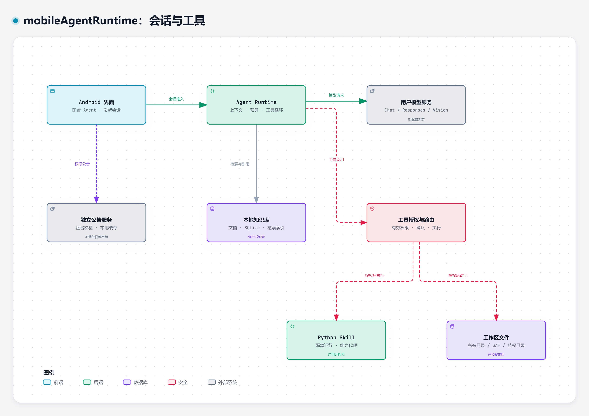

<!-- SPDX-FileCopyrightText: 2026 mobileAgentRuntime contributors -->
<!-- SPDX-License-Identifier: AGPL-3.0-only -->

# mobileAgentRuntime

mobileAgentRuntime 是运行在 Android 上的 Agent 工作台。你可以接入自己的模型服务，为不同任务组合提示词、知识库、Skills 和文件权限，在手机上完成资料问答、文档处理和工具调用。

应用在设备端保存配置、会话、知识文件和检索索引，并管理上下文、执行预算与授权。模型推理由你配置的服务提供；聊天、视觉处理和 API Embedding 会向对应服务发送所需内容。默认本地 Embedding 在设备上运行。项目的公告服务独立于模型接入。

本文面向已有 API 接入基础的用户，重点说明应用内的配置关系和使用流程。

## 功能

| 用途 | 应用提供的能力 |
| --- | --- |
| 多模型与多 Agent | 接入 OpenAI-compatible Chat Completions 或 OpenAI Responses，为 Agent 选择模型、提示词修订和运行预算 |
| 资料问答 | 导入文件、文件夹或 ZIP，建立本地知识库，结合全文与向量检索返回可追溯引用 |
| 图片与复杂文档 | 使用支持图片输入的模型处理图片、扫描页及需要视觉解释的内容，保留处理状态与视觉缺口 |
| Skills | 导入以 `SKILL.md` 为入口的技能包；符合兼容条件的 Python 程序可在隔离运行时执行 |
| 文件任务 | 在应用私有工作区、系统授权文件夹或已授权的特权目录中读写文件 |
| 外部工具 | 按配置使用联网搜索、远程 HTTP MCP，以及 Shizuku / Windows 有线 ADB Companion |
| 排障 | 查看脱敏请求预览、能力探测结果和导入进度，按需导出诊断 ZIP |



图表由 [Archify](https://github.com/tt-a1i/archify) 生成，概括会话执行路径。知识导入的视觉处理和 API Embedding 另见下文。[图表来源与复现方式](docs/diagrams/README.md)。

## 使用

### 安装与基本要求

- Android 8.0（API 26）及以上；正式包为 `arm64-v8a`，Debug/Review 另支持 `x86_64`。
- 从 [GitHub Releases](https://github.com/hedanbaomi/mobile-agent-runtime/releases) 获取正式 APK，或按本文的[源码构建](#构建)生成安装包。
- 准备可访问的模型端点、模型 ID 和凭据。需要图片输入或工具调用时，确认所选服务与模型支持相应协议能力。

主要页面从全局侧边菜单进入：**对话、智能体、服务商、知识、技能、公告、设置、MCP、请求检查器**。手机上点左上角菜单按钮，宽屏窗口使用常驻侧栏。

Debug/Review 与正式包签名不同，首次切换前先导出并核对需要保留的数据，不能直接覆盖安装。正式版本与发布附件说明见 [发布文档](docs/RELEASING.md)。

### 建立第一段会话

1. 在**服务商**中新建服务商，填写 Base URL、API 格式和凭据，再添加模型配置。先配置一个 `CHAT` 模型即可。
2. 选择模型并运行**测试连接**。需要工具调用或图片输入时，再执行**能力探测**；探测会发出实际请求，可能产生费用。
3. 在**智能体**中新建 Agent，选择 Chat 模型和提示词，保存配置。知识库、Skills 和工作区可以随后添加。
4. 在**对话**中选择该 Agent，新建会话并发送消息。
5. 需要处理自己的资料或文件时，按下文绑定知识库、Skill 或工作区，再创建使用新配置的会话。

新会话保存 Agent 配置快照。修改 Agent 的模型、提示词和资源组合，从新会话开始使用；撤销资源权限或禁用 Skill 仍会限制旧会话的后续调用。每个会话还持有自己的工作区绑定，修改 Agent 默认工作区只影响新会话。

### 配置模型

| API 格式 | 请求入口 | 选择条件 |
| --- | --- | --- |
| OpenAI-compatible | `POST /chat/completions` | 服务提供 Chat Completions 兼容接口 |
| OpenAI Responses | `POST /responses` | 服务实际支持 Responses 接口及其输入格式和事件流 |

Base URL 使用服务商提供的 API 前缀，例如 `https://api.example.com/v1`，不填写完整的聊天请求路径。切换 API 格式应以端点支持情况为准。

图片输入属于 Chat 模型的能力。若聊天或知识导入需要视觉处理，选择具备图片输入能力的 Chat 模型；为普通文本模型勾选图片能力不能使服务端获得该能力。API Embedding 使用单独的 `EMBEDDING` 模型配置。

连接测试用于检查当前目标的基础请求，能力探测分别检查所需能力。基础连接成功后，图片或工具探测仍可能失败，也可能因超时而处于未知状态。更换端点、模型或相关配置后，应重新检查能力。

#### 上下文、输出和参数

- **上下文窗口**可自动读取服务返回的元数据或受支持目录。无法取得可靠窗口时，按模型与服务商的实际限制手动填写；不要把“未知”当作无限窗口。
- **输出预算**可以跟随服务商，或手动设置。手动预算应与上下文窗口和任务长度匹配。
- **参数 JSON**用于传入模型需要的附加参数。按端点文档设置，避免同一输出限制同时使用多个字段别名。
- **Agent 预算**限制历史输入、模型请求次数和工具循环等运行行为；可按任务调整上下文压缩策略。

**请求检查器**用于核对有效参数、消息与工具列表。预览中的凭据会被脱敏，但消息内容仍可能包含你的资料，应在分享前检查。输入超限时，可缩短历史、减少绑定内容或调整压缩策略；单纯提高输出预算会进一步占用可用上下文。

### 使用知识库

1. 在**知识**中新建知识库，选择文件、文件夹或 ZIP。支持 TXT、Markdown、PDF、DOCX、EPUB 和常见图片；实际解析结果取决于文件内容与格式支持情况。
2. 含图片、扫描页或需要视觉解释的页面，选择合适的图片输入模型，并确认本批次的处理范围与费用授权。
3. 查看批次和文档状态。文件复制、暂存或入队完成之后，仍需要解析、视觉处理、分块和索引。
4. 内容就绪后，在 **Agent 配置**中绑定知识库，再新建会话。自动检索模式会把相关片段加入请求，回答中的引用可回到来源。

默认使用本地 ONNX Embedding，并结合 SQLite FTS5 与向量索引检索。切换 Chat 服务商不需要重新向量化知识库。若选择 API Embedding，需要额外配置模型与向量维度，并确认向外部服务发送相应文本；不同 Embedding 空间的向量不能混用，空间变更按页面提示处理索引。

#### 处理状态与恢复

| 状态或现象 | 含义与操作 |
| --- | --- |
| 暂存 / 排队 / 处理中 | 后台任务仍在执行，查看批次进度与阶段 |
| 等待视觉配置或确认 | 补齐图片模型、凭据或批次确认，再恢复处理 |
| 就绪 | 对应内容已发布到可检索索引 |
| 存在视觉缺口 | 仅有明确接受的文本降级内容；回答不应视作涵盖全部图片 |
| 失败 / 等待重试 | 查看原因，修正配置或文件后按提示恢复 |
| 结果未知 | 请求可能已由服务端处理；按该批次的恢复规则操作，重试可能再次计费 |

批次导入保存检查点，支持后台恢复和有界重试。**处理限制**中可设置 1–6 个并发请求及失败阈值等限额；从较低并发开始，按服务端限流和手机资源调整。恢复会复用满足缓存条件的成功结果，但不保证服务端恰好一次处理或计费。Android 后台限制、存储不足和应用被强行停止仍可能中断任务。

未配置可用视觉模型的含图资料会等待处理。需要只保留文本时，应明确接受视觉缺口；“已导入”或“有检索结果”不代表全部图文都处理完整。

### 导入 Skill

在**技能**中导入技能包，检查来源、许可、源码与兼容性，再安装、启用并绑定目标 Agent。导入成功、启用、绑定和授予程序能力是不同步骤。

- 只有指令的 Skill 可作为任务说明使用。
- 普通 Skill 不需要 `mobile-skill.json`；应用会分析兼容性。这个文件仅是本项目可选的执行扩展，兼容纯 Python 程序和部分标准库 CLI 可在 Android 隔离运行时执行。
- 依赖桌面系统、Node、Docker、未支持模块或第三方原生扩展的程序，会显示兼容性限制；具体支持范围以检查结果为准。

Python 通过能力代理访问已授权的知识、网络、模型调用或 Skill 存储。执行清单、当前授权、Agent 绑定和预算共同决定能否运行。包更新或新增能力可能需要重新授权。

## 工具与文件权限

### 选择工作区

| 工作区 | 使用方式 |
| --- | --- |
| 应用私有工作区 | 适合由 Agent 在应用内创建和管理文件 |
| 系统授权文件夹（SAF） | 通过 Android 文件选择器授予目录访问，受系统文件提供器与应用权限限制 |
| 特权目录 | 经 Shizuku 或有线 ADB 连接取得所选身份可访问的目录，再单独授权给 Agent |

在 Agent 配置中授予所需目录和文件能力，设置默认工作区，再建立会话。读取、写入、删除与补丁操作有各自权限；获得目录访问不等于获得所有操作权限。撤权、目录失效或连接不可用后，相关工具会受限。

工具调用默认需要确认。高级设置中的“跳过工具运行确认”只调整确认流程，仍受权限、快照、连接状态和预算检查约束。

### Shizuku 与有线 ADB

这些连接方式用于需要高权限文件访问或命令执行的任务，普通聊天与知识问答无需配置。

- **Shizuku**：先在设备上启动 Shizuku，再向应用授予权限，在应用设置中选择并检查接入通道。
- **有线 ADB**：在 Windows 运行本仓库的 Desktop Companion，通过 USB 连接 Android 设备，完成设备授权与应用配对。实施与配置见[有线 ADB Companion 文档](docs/plans/wired-adb-desktop-bridge.md)。

`shell_exec` 还要求当前构建允许控制能力、接入通道就绪、危险模式与命令权限有效。确认前核对命令、工作目录和来源。普通 Debug 构建禁用危险控制能力；需要验证这一流程时，使用不可调试的 Review 构建。所选 ADB 身份的权限也不等于 Root。

### 联网搜索、MCP 与公告

在**设置 → 联网搜索**中选择 Brave、Tavily 或 Exa，保存该服务的 API Key 并启用。各服务的密钥分别加密保存，切换服务不会覆盖其他密钥；移除密钥只影响当前服务。已有 Brave 配置可继续使用。

在**智能体 → 编辑 → 允许联网搜索**中决定该 Agent 是否能搜索，默认关闭。开启并保存后，新会话可以直接调用 `web_search`，无需逐次批准，查询可能产生服务商费用；关闭并保存后，旧会话也立即失去搜索权限。该开关独立于其他工具的确认设置。搜索只返回有界的标题、链接和摘要，不自动打开网页。配置、权限和请求边界见[联网搜索](docs/WEB_SEARCH.md)。

MCP 页面用于配置远程 HTTP 服务、发现工具和确认绑定；Android 端不会自动启动桌面上的 stdio、Node 或 Shell MCP 服务器。外部工具的描述与返回内容按不可信资料处理，不能自行扩大本地权限。

公告使用独立的签名服务与本地缓存，获取公告不携带模型凭据。匿名统计默认开启，可在设置中关闭；已保存的关闭选择在升级后保持，关闭统计仍可阅读公告。

## 排障与诊断

| 问题 | 先检查什么 |
| --- | --- |
| 连接测试失败 | Base URL、API 格式、模型 ID、凭据和端点可达性 |
| 能聊天，但图片或工具失败 | 分别探测能力，核对端点协议和实际模型支持；未知结果不能直接认定为不支持 |
| 自动上下文窗口未知 | 是否有可靠元数据；必要时按服务商限制手动配置 |
| 输入预算不足 | 历史、知识片段、图片及工具 schema 的总量，以及输出预留 |
| 导入后仍不可检索 | 文档是否就绪、视觉确认是否完成、索引是否可用、Agent 是否绑定该库 |
| Python 程序不可运行 | 兼容性等级、依赖、启用状态、Agent 绑定与能力授权 |
| 工作区或命令工具未出现 | 会话工作区、有效权限、模型工具能力，以及特权通道和构建限制 |

需要提交故障现场时，在**设置**中开启**应用内诊断记录**，复现后选择**导出诊断 ZIP**。一并说明操作步骤、发生时间、构建版本和预期结果；确认导出成功后再清除日志。

诊断默认关闭，日志级别默认 INFO，保留阶段、结果与错误。在设置页可切换为 DEBUG，记录详细进度和经凭据脱敏的视觉处理文本；级别选择会保存。分享 ZIP 前检查是否含有敏感资料，切回 INFO 不会清除已有 DEBUG 记录。系统 ANR、原生崩溃等信息可能还需要同一安装包的 ADB Logcat。诊断机制见[诊断文档](docs/DIAGNOSTICS.md)。

## 构建

使用 JDK 17、Android SDK 35 和仓库内 Gradle Wrapper。通过 Android Studio 或 `local.properties` 设置 SDK 路径；原生库、Python 运行时和模型包使用仓库锁定的来源与校验值，首次构建需要下载相应依赖。

在仓库根目录执行；以下为 Windows PowerShell 示例：

```powershell
.\gradlew.bat :app-android:assembleDebug --dependency-verification=strict
adb install -r .\app-android\build\outputs\apk\debug\app-android-debug.apk
```

Debug 包适合调试应用与普通功能。生成 Debug 密钥签名、不可调试的 Review 包：

```powershell
.\gradlew.bat :app-android:assembleReview --dependency-verification=strict
adb install -r .\app-android\build\outputs\apk\review\app-android-review.apk
```

Review 使用本地 Debug 签名身份，不是正式 Release。覆盖安装要求签名相同；设备上已有其他签名版本时，先处理数据保存与迁移。正式 Release 需要显式配置签名材料，不会回退到 Debug 密钥。

### 提交前检查

提交前运行仓库门禁；REUSE 命令需要已安装 `reuse`：

```powershell
.\gradlew.bat licenseGuard licenseGuardReverse check verifyCiPins verifyDependencyLock verifyDependencyVerification --dependency-verification=strict
reuse lint
```

## 代码结构

| 目录 | 内容 |
| --- | --- |
| `app-android/` | Android 应用、平台适配、通道与工具集成 |
| `feature/` | Compose 页面和交互状态 |
| `shared/` | 领域模型、Agent Runtime、Provider、知识、Skill 与公告协议 |
| `data/sqlite/` | 持久化、迁移、仓储和索引协调 |
| `runtime/` | 平台运行时，包括本地 Embedding、Python 与后台任务 |
| `desktop/bridge/` | Windows 有线 ADB Companion |
| `services/announcements/` | 公告 Worker、存储与管理端 |
| `docs/` | 技术契约、设计、验收和变更证据 |

开发资料：[贡献指南](CONTRIBUTING.md) · [技术实现方案](docs/IMPLEMENTATION_PLAN.md) · [知识库契约](docs/KNOWLEDGE.md) · [Skill 与权限模型](docs/SKILLS_AND_SECURITY.md) · [验收项](docs/ACCEPTANCE.md)。

## 许可证

第一方代码和项目文档采用 **AGPL-3.0-only**。完整文本见 [LICENSE](LICENSE)，归属与分发要求见[许可证政策](LICENSE_POLICY.md)。第三方依赖、模型包、用户知识库和外部 Skills 保留各自许可。
