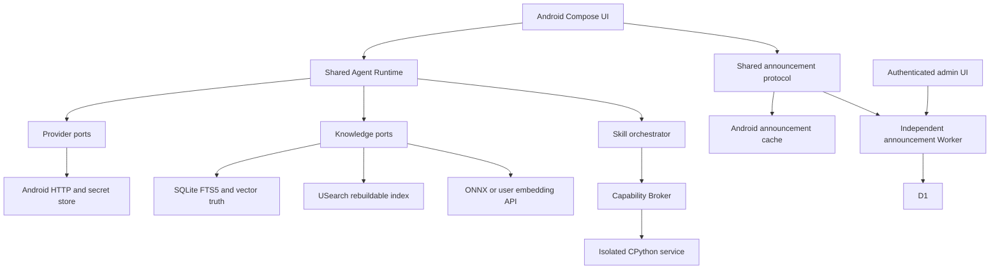

<!-- SPDX-FileCopyrightText: 2026 mobileAgentRuntime contributors -->
<!-- SPDX-License-Identifier: AGPL-3.0-only -->

# 技术实现方案

版本：v1.2 设计基线，2026-08-28。状态：**部分实现**。M0 本地构建/许可已落地；M0.5 软件页面 UI 设计基线已全面完成。M1 已接通 OpenAI 兼容流式 Chat、Keystore 密钥引用、TXT/MD SAF 导入与含图等待；现有 UI 须按 M0.5 设计补齐。M2 本地公告闭环已落地（未部署 Cloudflare）；NAR01—NAR07 已在本地修复。M3 文本路径本地 JVM 已落地：CAS 多库、代际索引、FTS+`local-hash-v1-d32`+RRF；KAR01—KAR08 已在本地修复。M4 本地 JVM 已落地：PDF 文本、DOCX/EPUB 正文与内嵌图、Vision 等待/同意/缓存、严格模式与引用页/图定位；**不是** PDF 光栅化渲染包、**不是** ONNX、**不是** K06 设备负载。M5 本地 JVM 已落地：Skill 包 A—E 分类与安装拒绝、内置工具与 Tool Loop；**不是** CPython 隔离（M6）、**不是** 完整 MVP。完整 MVP、CPython、USearch JNI、公告生产部署仍未完成。

开工入口：[agent.md](../agent.md) → [HANDOFF.md](../HANDOFF.md) → 本文。范围依据见 [REQUIREMENTS.md](REQUIREMENTS.md)。含图知识库、Python 隔离和公告分别详见专题，不能只实现本文概要。

## 1. 不可变更要求

- Android 首版；云端模型由用户自行接入。手机负责数据、检索、Skills、上下文和调度，不承担完整 LLM。
- 用户自由配置 System Prompt、Provider、模型、参数，能够查看真实有效请求。API Key 与本地敏感数据不进入项目后端。
- 本地知识库包含文字、图片、图表、公式。发现图片而未配置合格 Vision 模型时必须等待，不能静默丢弃。
- Python 来自用户主动导入的本地 Skill，必须隔离执行、能力代理、逐次授权检查；不运行任意原生扩展或系统命令。
- 公告是首版正式需求，独立于模型服务，在早期里程碑完成。
- 第一方代码、服务端、管理端和文档全部 `AGPL-3.0-only`；M0 许可防线先于业务实现。没有 commit/push/部署授权就不执行这些动作。

## 2. 架构和边界



共享层只认识接口、不可变数据、状态机和规则，不出现 `Context`、Activity、Android URI、Binder、Room Entity 或具体数据库连接。进程、文件句柄、网络和秘密注入均在平台适配器。

Cloudflare 只承载公告及其必要管理/统计，**不是模型代理或知识库服务器**。Provider 更换不迁移知识库；Agent 复用知识库不重新向量化。未来其他端实现端口适配器，首版不启用其他平台 target。

## 3. 技术基线与验证关口

| 位置 | 对话选型 | 实施约束 |
| --- | --- | --- |
| Android | API 26+；arm64-v8a 正式、x86_64 测试；Kotlin/Compose | M0 锁定 JDK/Gradle/AGP/Kotlin/SDK 兼容组合，不盲目取最新版 |
| 共享业务 | Kotlin Multiplatform，仅 Android target；Ktor；kotlinx.serialization | 领域/协议/算法可移植；UI 保持 Android 原生 |
| 本地存储 | AndroidX Bundled SQLite + FTS5 | 验证实际打包的 FTS5 能力和 ABI；迁移、外键、事务测试 |
| 向量 | USearch HNSW，经 C/JNI | SQLite 存向量真值；USearch 只是派生索引；维度和指纹强校验 |
| 本地推理 | ONNX Runtime Mobile，可替换 Model Pack | 权重/Tokenizer/预处理/许可/校验值统一版本，不内置未经确认的模型 |
| 解析 | TXT/MD；PdfRenderer + PDF 结构适配；DOCX/EPUB 解包 | 可替换 DocumentParser；矢量 PDF 页面必须保留视觉证据 |
| Python | CPython 官方 Android 嵌入包 3.14.x，固定已测版本 | 必须先验证 isolated service 内加载、FD、Binder、销毁；不能用普通子进程冒充 |
| 后台导入 | 用户可见前台任务；WorkManager 补偿 | 不承诺后台无限运行；适配当期 SDK 的服务类型、启动条件与时限 |
| 公告 | Worker + D1 + 管理 UI | 独立资源；定向、签名、离线及关闭统计仍可读公告 |

各依赖精确版本、下载来源、校验值、ABI、许可与验证结果记录在版本目录/锁文件及 ADR。Android 最低版本与原生依赖冲突时停止该集成并提出方案，不擅自提高最低系统版本或删除功能。

### 3.1 已核查的技术限制

以下为2026-08-28的公开资料核查，不是本项目构建结果。实现时仍需复核锁定版本：

- [CPython Android文档](https://docs.python.org/3/using/android.html)和[Android发布包](https://www.python.org/downloads/android/)支持嵌入路线；具体3.14.x包、stdlib模块和最低API需实测，不能承诺完整桌面Python兼容。
- [Android Service文档](https://developer.android.com/guide/topics/manifest/service-element)描述无应用权限的isolated进程；这不自动保证每次新进程，销毁/重新启动与无残留是本项目必须证明的要求。API26路径使用Java Binder/ParcelFileDescriptor，不依赖API29+ NDK Binder FD接口。[ParcelFileDescriptor参考](https://developer.android.com/reference/android/os/ParcelFileDescriptor)
- [USearch v2.26.1发布构建](https://github.com/unum-cloud/USearch/blob/v2.26.1/.github/workflows/release.yml)这一核查样本的Android ABI没有x86_64。M0/M3必须选择有证据的兼容artifact或自行构建x86_64 JNI并测试，不能默认上游包已经覆盖模拟器。
- [BundledSQLiteDriver](https://developer.android.com/reference/androidx/sqlite/driver/bundled/BundledSQLiteDriver)需要明确线程/连接策略；单连接不能无保护跨线程。FTS与外部内容一致性由实现维护。[FTS5规范](https://www.sqlite.org/fts5.html)
- [ONNX Android构建](https://onnxruntime.ai/docs/build/android.html)与[移动端说明](https://onnxruntime.ai/docs/tutorials/mobile/)中的ABI、算子/EP和模型约束必须进入锁文件与真机验证；启用R8时按实际版本保留所需JNI类。
- [Android前台服务变更](https://developer.android.com/develop/background-work/services/fgs/changes)和[超时规则](https://developer.android.com/develop/background-work/services/fgs/timeout)要求按系统/target SDK适配启动条件、服务类型、通知、超时与配额；不得把前台服务作为无限后台算力。确定服务类型后实现onTimeout、检查点和用户恢复路径。

## 4. 目标目录与单一职责

下列是**计划目录**，本轮不创建空业务模块冒充完成。

```text
app-android/                  Android application、DI、导航、打包
shared/domain/                ID、配置、错误、实体和快照
shared/agent-runtime/         Prompt、Context、Tool Loop、预算
shared/provider-api/          ModelAdapter 与能力协议
shared/knowledge-api/         导入、检索、引用、指纹
shared/skills-api/            清单、权限、调用协议
shared/announcements/         公告 DTO、定向、灰度、状态规则
shared/serialization/         schema 版本、导入导出
data/sqlite/                  SQL、迁移、repository 实现
runtime/embedding-onnx/       本地 Embedding Model Pack
runtime/vector-usearch/       JNI、索引生命周期
runtime/python-android/       CPython、isolated service、SDK 桥
platform/android/storage/     SAF、CAS、只读句柄
platform/android/security/    Keystore、Secret Redactor、权限
platform/android/background/  前台导入、WorkManager、恢复
platform/android/ipc/         Binder、调用身份、进程生命期
feature/chat|agents|providers|knowledge|skills|announcements|settings/
services/announcements/       Worker、D1 migrations、协议测试
admin/announcements/          管理 UI、预览、审计入口
build-logic/license-guard/    第一方许可规则和反向测试
docs/adr/                     经验证的架构取舍
docs/design/                  M0.5 高保真页面稿、可编辑源稿、设计 token、原型（计划产物）
docs/evidence/                脱敏的验证结果，按任务分目录
```

`feature/*` 只调用共享用例，不能绕过权限系统直连 Python 或直接访问秘密。主 App 负责注入适配器。公告 Worker 不依赖客户端模型层。未来协议测试向量可以以 JSON 共用，但不强求 Worker 使用 Kotlin。

## 5. 领域模型与持久化契约

所有公共导入导出使用 `schemaVersion`，未知主版本明确拒绝；UTC 时间、稳定字符串 ID、数字范围显式验证。数据库升级逐版迁移，失败保留原库，不自动清空重建用户数据。

| 实体/逻辑表 | 必要字段与约束 |
| --- | --- |
| ProviderProfile | id、name、apiFormat、baseUrl、headerSecretRefs、nonSecretHeaders、secretRef、revision；没有明文密钥 |
| ModelProfile | id、providerId、role、modelId、capabilities、parameterSchema、context/output limits、revision |
| AgentProfile | id、name、promptRevisionId、chat/vision/embedding/rerankerProfileId、retrieval/context/permission settings、revision |
| agent_knowledge / agent_skills | agentId + resourceId 联合唯一；引用不能隐式扩大资源权限 |
| PromptRevision | id、agentId、parentRevisionId、template、allowedVariables、createdAt；旧版本不原地覆盖 |
| Conversation | id、snapshotId、title、createdAt、updatedAt；显式换配置创建新快照边界 |
| AgentSnapshot | id、schemaVersion、配置展开值、模型/Provider 的非秘密修订、资源 ID/版本、createdAt；不可变 |
| Message | id、conversationId、parentMessageId、role、typed parts、status、createdAt；文本、图片引用、tool result 分类型 |
| Run / ToolInvocation | runId、snapshotId、state、budget、stopReason；toolCallId、permissionDecision、status、resultRef；唯一调用去重 |
| AuditEvent | id、runId、时间、component、action、结果、errorCode、字节/Token 数、脱敏摘要；不默认保存正文 |

知识库的 Document/Asset/Chunk/Embedding/IndexGeneration/ImportJob、Skills 的安装/授权和公告表见对应专题。数据库级外键、唯一约束和应用层授权同时存在，不使用模型输出来决定实体归属。

删除 Provider 时提示被引用配置并保留快照的非秘密来源；秘密删除后旧对话续跑返回 `SECRET_UNAVAILABLE`，不自动切换其他 Provider。删除知识库不得删除其他知识库引用的 CAS blob；先解除引用并事务标记，再回收无引用内容。

Agent 的 embeddingProfileId 是新建/选择索引的偏好，不可覆盖已绑定知识库的实际向量空间；不匹配返回明确错误或用户确认重建。详见 [KNOWLEDGE.md](KNOWLEDGE.md)。

会话快照固定Prompt、模型、参数和资源绑定，不等同于永久冻结用户知识库内容。每次Run在开始时选择并固定当前READY的KB代际，记录版本供引用追溯；本次Run期间切索引不混用代际。知识库更新后续问答可使用新代际并在运行记录中显示变化；撤权/删除始终优先于旧快照，不能借历史版本访问已撤销资源。

## 6. Provider、参数和 Prompt

### 6.1 Provider adapter

首个可交付适配器为 Custom OpenAI-Compatible。API Format 是明确枚举和能力组合；不假设所有号称 compatible 的服务都支持相同流式、工具、图片或 structured output。其他厂商原生协议、JS按后续范围单独实现；MCP Adapter保留在M7。不得靠伪装兼容实现静默降级。

目标端口（Kotlin 接口示意，相关类型在实现时定义；不是当前可编译代码）：

```kotlin
interface ModelAdapter {
    suspend fun probe(profile: ModelProfile): CapabilityReport
    fun stream(request: ModelRequest): Flow<ModelEvent>
    suspend fun embed(request: EmbeddingRequest): EmbeddingBatch
}

interface SecretStore {
    suspend fun resolveForHost(ref: SecretRef): SecretHandle
}
```

`ModelEvent` 最少包含 TextDelta、ToolCallDelta、Usage、Completed、Failed。流式 tool call 按 provider call ID 聚合，完整 JSON 和 schema 校验后才执行；残缺、未知工具或重复 call ID不执行。取消关闭流和关联工作，不把半截回答当完整成功。

能力可由模型清单、用户手动配置和轻量测试共同形成，记录来源和时间。能力测试会向用户 Provider 发请求并可能计费，须明确告知；不自动遍历所有模型收费探测。

### 6.2 参数合并

构建顺序：适配器默认 → ModelProfile 通用/特有参数 → Agent 覆盖 → 经校验的自定义 JSON → 由 Runtime填入保留协议字段。冲突显示来源；JSON 根必须是 object，禁止非有限数值和超预算值。

保留字段：`model/messages/input/tools/tool_choice/stream/authorization/api_key`，以及适配器声明的等价/嵌套协议字段。不得以 JSON 大小写或嵌套包装绕过禁止。模型名和工具配置必须在专门的 UI更改，认证 Header 由 SecretStore注入。自定义 Header 中的密钥同样作为 secret 存储；禁止覆盖 Host、Content-Length 等传输控制 Header。

未知额外参数允许高级用户显式发送；保留字段和安全限制不允许。参数在本模型不支持时明确提示，不静默删除或切换模型。用户看到实际发送结果和脱敏 Provider 错误；错误正文也经过 Secret Redactor。

### 6.3 Prompt 和上下文

Effective Prompt分层显示：Runtime Contract（用户可见只读）→ User System Prompt → 已启用 Skill Instructions → 标明来源的检索内容 → 历史 → 当前消息。界面显示适配器最后采用的真实角色映射和正文，不展示一个与网络请求不同的“示意 Prompt”。

模板变量仅允许固定白名单，如 date、agent_name、knowledge_bases；不执行表达式、脚本、路径读取或递归模板。Skill 指令与知识块不得成为权限来源。Request Inspector 默认不持久化正文，明确列出将离开设备的片段/图片和目标 Provider；导出单独确认并脱敏。

ContextPolicy至少包含 maxHistoryMessages、knowledgeTokenBudget、maxInputTokens、reservedOutputTokens、imageBudget。优先保留当前消息和工具配对，裁剪旧历史和低相关证据，不截断工具 JSON；能力缺失时采用明确的保守预算并提示。不能通过调低计算结果绕过 Provider真实窗口限制。

## 7. Agent 执行契约

### 7.1 状态和预算

```text
CREATED → VALIDATING → RETRIEVING → ASSEMBLING → MODEL_STREAMING
                                                ↓
                                      WAITING_TOOL_APPROVAL
                                                ↓
                                         TOOL_EXECUTING
                                                ↓
                                  ASSEMBLING → MODEL_STREAMING

终态：COMPLETED / CANCELLED / FAILED / BUDGET_EXHAUSTED
暂停：WAITING_FOR_CONFIGURATION / WAITING_FOR_USER
```

RAG 可由用户设置为自动检索或显式 knowledge_search；不得无条件把整个库加入上下文。每个 Run固定快照，实时撤销授权优先于旧快照中的授权，旧 grant不能恢复新近撤销的权限。

工程默认：最多 8 个模型交互轮、20 次工具调用、总运行 180 秒；Python 单次限额另见专题。所有预算由本地 Runtime限制；Skill内部模型调用计入子预算和总预算。参数可在明确上限内调整，不能通过 Skill或远程公告修改。

### 7.2 Tool Loop

1. 校验模型能力、资源授权、知识库状态和请求预算；缺条件暂停，不能无声跳过。
2. 生成检索证据集和固定引用 ID；构建真实请求，展示可审查内容。
3. 接收流式消息；完成且验证 tool arguments 后交权限系统。
4. 每次调用生成 invocationId，绑定 runId/skillId/包哈希/授权版本。需确认的副作用进入等待界面，用户拒绝则产生结构化拒绝结果。
5. 执行器返回 typed result，输出标记为不可信数据；截断大输出保留原始尺寸、摘要和 artifact引用。
6. 将工具结果按协议回传模型；到达停止条件或预算终止。无工具能力的模型只能进入用户明确选择的纯问答，不从自然语言中猜命令执行。

只对明确可安全重试的读操作退避重试；HTTP POST、文件写入、模型超时、已执行工具不得盲目重放。应用进程被杀后把不确定调用记为 `UNKNOWN_OUTCOME`，用户确认后再重试，不能声称分布式调用恰好一次。

### 7.3 统一错误

错误对象包含 code、userMessage、retryClass、stage、operationId、sanitizedDetails。至少覆盖：`INVALID_CONFIG`、`CAPABILITY_MISMATCH`、`SECRET_UNAVAILABLE`、`PROVIDER_UNAUTHORIZED`、`RATE_LIMITED`、`NETWORK_UNAVAILABLE`、`CONTEXT_OVERFLOW`、`PERMISSION_DENIED`、`UNSUPPORTED_DEPENDENCY`、`RESOURCE_LIMIT`、`UNKNOWN_OUTCOME`、`INDEX_NOT_READY`、`SCHEMA_UNSUPPORTED`。不得将 Python异常堆栈、文件真实路径或认证头直接写入共享日志。

## 8. UI 与用户流程

| 页面/流程 | 最小完成条件 |
| --- | --- |
| Provider | 增删改、连接/能力测试、Secret引用、真实错误、费用提示 |
| Agent | 独立配置、Prompt版本、参数、绑定 KB/Skill、快照边界 |
| Chat | 流式/取消/恢复状态、工具确认、引用回跳、有效请求检查 |
| Knowledge | 导入、资源/图片数量、处理状态、等待原因、暂停恢复、删除/重建 |
| Skills | 来源/许可/签名/兼容性/源码/权限；安装、禁用、撤销和调用日志 |
| Announcements | 固定入口、未读、历史、横幅、重要确认；失败不影响其他能力 |
| Settings/About | 数据/导出/隐私开关、源代码与版本、AGPL和第三方许可 |

用户首次完成 Provider → Agent → 本地知识导入 → 处理费用/隐私确认 → 索引就绪 → 带引用问答的闭环。全流程必须能说明“什么在本地、什么发送给谁”。

### 8.1 M0.5：软件页面 UI 设计

用户所说的“前端页面设计”指 **Android 软件页面本身的 UI 设计**：逐屏确定页面长什么样、内容如何排版、颜色/字体/图标/控件如何使用，并实际制作可供用户评审的高保真设计稿，再由 M1—M7 实现对应界面。导航、交互和组件规范为页面设计提供配套说明；只有页面清单、流程图或技术文字说明不能算本阶段完成。公告管理 Web 界面保持 M2 原有设计/实现范围，不增加其他用户端平台。阶段安排见 [ADR-0002](adr/0002-frontend-design-milestone.md)。

必须设计的软件页面如下，每类均需主页面及列出的关键子页面/状态稿：

| 软件页面 | 必须制作的页面设计稿 |
| --- | --- |
| Chat | 会话列表、聊天详情、输入区、流式/取消、工具确认、引用卡片/原文回跳、有效请求检查面板 |
| Agents | Agent 列表/详情、创建/编辑、Prompt 编辑、模型/参数配置、知识库/Skill 绑定、快照变更提示 |
| Providers | Provider 列表/编辑、Base URL 与密钥输入、模型选择/能力配置、连接测试成功和失败状态 |
| Knowledge | 知识库列表/详情、导入选择、文档列表/详情、导入进度、Vision/上传授权等待、原文/原图查看、删除/重建确认 |
| Skills | Skill 列表/详情、来源/许可/源码/权限展示、导入安装、启用/禁用/撤销、调用记录 |
| Announcements | 公告中心、详情、未读状态、横幅、重要公告确认弹窗 |
| Settings/About | 隐私/统计设置、数据导入导出、版本与来源、AGPL/第三方许可页面 |

设计任务按以下顺序执行：

1. **页面布局与视觉方向**：盘点已有页面，确定信息层级、主次操作、导航位置、内容密度和整体视觉风格；完成颜色、字体、间距、圆角、图标及控件的具体选值。品牌未确认时使用工程名，暂定视觉方向须说明并由用户确认。
2. **逐屏高保真设计**：实际绘制上表各页面，展示接近最终软件效果的排版、真实长度的示例文案、数据卡片、列表、表单和弹窗；以统一组件规范制作明暗主题及必要的尺寸适配稿。线框稿可用于早期讨论，阶段交付必须包含高保真页面稿和可编辑源稿。
3. **页面状态与交互补齐**：为各页面分配稳定 `screenId`，列出字段/校验、主次操作、导航/返回和未保存离开行为；制作空数据、加载、失败、离线、未配置/无权限、处理中、取消/重试等关键状态稿。Vision/上传同意等待、流式中断/结果未知、预算耗尽、撤权和删除确认须在具体页面呈现，不用一张通用错误示意图代替。
4. **可点击的软件界面原型**：使用已设计的页面串联 Provider → Agent → 知识库 → Chat/引用，以及 Skill、公告、设置流程。原型保留页面实际布局和样式，示例数据/模拟状态醒目标识；不连接真实 API、不上传知识库、不产生真实授权或发布副作用。
5. **用户评审与开发交付**：逐页评审外观、布局、可读性和操作方式，记录用户修改意见并修订；交付页面尺寸/间距/字号等标注、组件/token、图片/图标素材及使用许可、可编辑来源、页面到模块/用例/状态/阶段/验收的映射。现有 M1 页面附保留/调整/补齐清单；接口缺口显式登记，不能以 UI 设计改变安全边界。

### 8.2 M0.5 交付的设计包

下列为 M0.5 阶段已完成交付的设计产物包（页面与文档全量禁用 Emoji）：

| 交付产物 | 包含内容与规范 | 接收方 |
| --- | --- | --- |
| [docs/design/screens/](design/screens/README.md) | 按 `screenId/主题/状态` 编号的高保真矢量页面图（SVG，全量禁用 Emoji）；覆盖七大类主页面、子页面和关键状态；附尺寸/布局/样式标注 | 用户逐页评审、UI 实现 Agent |
| [docs/design/source/](design/source/README.md) | 可编辑矢量设计源稿及素材、许可和使用说明；接手者能无损修改页面 | 后续设计与页面实现 Agent |
| [docs/UI_DESIGN.md](UI_DESIGN.md) | 页面稿索引、视觉方向、导航/交互、组件/布局规范、设计修订和待决项；以页面稿为核心组织说明 | 后续 UI 实现与评审 Agent |
| [docs/design/ui-tokens.json](design/ui-tokens.json) | 有版本号的语义 token、明暗主题的具体值及命名；组件规范说明如何映射到 Compose | 组件与页面实现 Agent |
| [docs/design/ui-prototype.html](design/ui-prototype.html) | 使用上述页面样式制作的本地可点击软件原型与交互演示；覆盖成功与失败/等待路径；无真实付费 API 副作用 | 用户及交互评审者 |
| [docs/design/ui-implementation-map.md](design/ui-implementation-map.md) | `screenId → 页面稿/组件 → 模块/路由 → 状态/动作/用例 → M阶段 → 验收ID`；现有页面差异、实现顺序和文件责任 | 任务拆分与集成 Agent |
| `docs/evidence/<日期>-m0.5/` | 页面/状态覆盖清单、不同尺寸/主题/字体下的原型走查结果、用户确认与修改记录 | 后续验收与交接 |

屏幕适配至少审查紧凑竖屏、横屏/宽屏、软键盘遮挡及大字体；交互规范明确触控尺寸、对比度、焦点顺序、读屏标签，状态不能仅靠颜色区分。原型布局检查不等于 Android 设备无障碍测试，M1—M7 实现后仍要执行对应设备验收。

### 8.3 设计冻结与实现依赖

M0.5 退出需满足 [ACCEPTANCE.md](ACCEPTANCE.md) 的 U01—U06：逐屏高保真页面稿、可编辑源稿和配套设计包齐全；页面布局/视觉风格统一；关键流程可走通；安全/隐私状态无矛盾；用户确认页面外观及操作方式，并记录设计修订号和评审证据。未确认项保持待定，不能仅凭页面数量或文字方案标记通过。

M0.5 通过只表示设计基线可供实现，记为 `DOC_CHECK_PASS`；不代表页面代码、真实 API、设备或部署通过。后续每个 UI 工作包必须引用设计修订和 `screenId`，实现后复核 U 系列适用项及原 A/K/S/N 验收。变更导航、主要交互、授权/费用说明或关键状态时同步设计包和验收；不能在业务实现时自行另造一套页面方案。

现有 M1 页面属于已实现的早期界面，不回滚其业务修复，也不补记 M0.5 已通过。新增设计阶段须先盘点现状、形成差异清单；后续按设计分批对齐并保留已验证行为。

## 9. 开发工作包与依赖

原 S5 里程碑插入 S6 公告阶段后，原 M2—M6 已依次映射为本文 M3—M7。用户本次要求再增加专门的软件页面 UI 设计步骤，因此在 M0 与 M1 之间插入 **M0.5**，保留现有 M0—M7 的含义和历史编号，避免公告、Python 和发布验收引用错位。具体接口、预算和工作包边界属于实施补充。

主顺序：`M0 → M0.5（软件页面 UI 设计）→ M1 → M2 → M3 → M4 → M5 → M6 → M7`。原有可并行/提前技术验证规则仍须满足各自入口，不因新增设计阶段扩大授权。

| 阶段 | 工作包与责任目录 | 入口条件 | 退出证据 |
| --- | --- | --- | --- |
| M0 | 构建/许可：根目录、build-logic、CI、ADR、版本锁 | 明确开发授权；仓库/包名等确认 | L01—L04；真实构建；许可反向测试；独立审阅 |
| M0.5 | 软件页面 UI 设计：逐屏绘制 Android 七类页面的布局、视觉样式和控件；责任目录 `docs/design/`、`docs/UI_DESIGN.md` | M0完成；需求、领域状态和安全边界明确 | U01—U06；高保真页面稿、可编辑源稿、组件/标注、可点击原型、用户外观/操作确认；不以技术文字替代页面设计 |
| M1 | Provider/Agent/Chat：shared/domain/provider/runtime、相关 feature；公告客户端协议、缓存、容器和安装 ID | M0完成 + M0.5设计基线通过 | A01—A06；U系列适用项的实现验证；公告本地 fixture；密钥/请求脱敏验证 |
| M2 | 公告 Worker/D1/Admin（含管理端页面设计）与 Android联调 | M1协议固定；M0.5公告客户端页面设计；独立本地/测试资源 | N01—N09；U系列适用项的客户端实现验证；本地管理发布到客户端展示；部署单独授权 |
| M3 | 文本知识库：storage/parser/sqlite/embedding/vector/retrieval | M1模型能力 + M2公告闭环 | K01、K02、K05—K08；损坏索引恢复与导入中断 |
| M4 | 多模态知识库：Vision、页面/图片、DOCX/EPUB、证据回跳 | M3 + Vision接口验证 | K03、K04、K06、K08；不重复处理成功图片 |
| M5 | 内置 Skills、清单导入、权限和 Tool Loop | M1契约 + M3查询接口 | S01、S02、S08—S10；无 Python也可验证 Broker |
| M6 | 隔离 CPython最小技术验证、纯 Python SDK、资源控制 | M0原生构建链 + M5权限；先做隔离可行性验证 | S03—S07；arm64真机+x86_64；安全独立审阅 |
| M7 | Agent/Knowledge/Skill导入导出、schema/迁移、崩溃恢复、MCP Adapter、Remote Skill Executor接口、多端端口稳定、许可/隐私/安全审阅 | M0—M6及M0.5证据齐备 | 全验收矩阵，含U01—U06、S11和A07；仍区分准备完成与实际发布 |

M0 可以并行准备本地许可和构建，但没有远程仓库/Ruleset授权时记为 M0_REMOTE_PENDING，**不得宣称 M0完成**或绕过许可防线。发布与生产部署始终是独立授权，不隐含在 M2/M7。

功能完整的MVP必须到M6（含Python Skills）通过后才可宣称，不得把纯问答或只有Native工具的M5当作完整MVP。M6的原生隔离风险可在M0完成后提前开展最小可行性实验，不改动M1—M5接口或减配安全要求；实验产物必须标明spike，验证通过后再纳入正式实现。

实现工作包交付相关代码、适用的数据库迁移/机器 schema、正反向测试、脱敏证据、文档同步和 HANDOFF 记录；M0.5 交付第8节的设计包，不要求为凑齐代码产物而提前实现业务。M3—M7 的页面同样受设计基线和 U 系列适用项约束。多个 Agent 只能认领不重叠目录；共享 schema、迁移和设计 token 由指定集成者单写。

## 10. 首个开发任务如何开始

M0 本地构建与许可任务已存在。远程 Ruleset 仍为 `M0_REMOTE_PENDING`，不得宣称 M0 全部完成。后续工作从 HANDOFF 的下一步开始，而不是再从空工程初始化。

本次仅新增 M0.5 工作包，未制作或验收实际设计包，也未解除 M0 的未决门禁。满足入口后，设计 Agent 先完成第8节及 U01—U06；现有 M1 界面的补齐按差异清单另行实施。

```powershell
.\gradlew.bat licenseGuard
.\gradlew.bat licenseGuardReverse
.\gradlew.bat :app-android:assembleDebug
python -m reuse lint
```

远程 owner和保护能力未确认时停留在 M0未完成，不伪造 CODEOWNERS 身份，不申请过宽权限。后续按 [ACCEPTANCE.md](ACCEPTANCE.md) 验证，任何实现变化在同一轮维护本方案、专题文档和交接。
