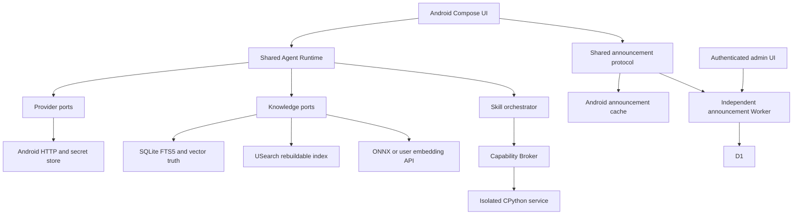

<!-- SPDX-FileCopyrightText: 2026 mobileAgentRuntime contributors -->
<!-- SPDX-License-Identifier: AGPL-3.0-only -->

# 技术实现方案

> **v3.12 复审 PDF 字典词法与 ZIP 正文 CRC（2026-09-11，JVM 定向修复已落地）**：键查找改为词法走 token 流（`findTopLevelValueStart`），只认当前层级键、按键值交替推进、整体跳过注释/字面量串/嵌套结构/间接引用，`dictionaryEnd`/`arrayEnd` 同步跳过这些；`arrayBody` 区分「缺失/畸形/合法空」，畸形 `/Differences` fail closed 进入 Vision。文件型 ZIP 在交给 `onEntry` 前核对实际解压字节的尺寸与 CRC-32。fingerprint `pdf-text-v14-pdfrenderer`。证据见 [4f0556d 复审](evidence/2026-09-11/review-4f0556d-dictionary-lexicon-and-zip-crc.md)。
> **v3.11 终轮复审字典键解码与 CI 内存门禁（2026-09-10，JVM 定向修复已落地）**：字典键按 32000-1 7.3.5 解码后再匹配，`/Enc#6Fding`、`/Diff#65rences`、`/Fil#74er` 与字面写法等价，不再因键「看似缺失」而丢弃 `/Differences` 或跳过 FlateDecode；fingerprint `pdf-text-v13-pdfrenderer`。主 CI `check` 失败根因是 review 变体 D8 外部 dex 合并 `OutOfMemoryError`，`org.gradle.jvmargs` 提升到 `-Xmx4g`，门禁步骤未减。证据见 [7500ad3 终轮复审](evidence/2026-09-10/review-7500ad3-final-keys-and-ci.md)。
> **v3.10 独立复审内置字体编码边界（2026-09-10，JVM 定向修复已落地，本地未提交）**：PDF 名称按 32000-1 7.3.5 解码 `#xx`（`Sym#62ol` 与 `Symbol` 等价，资源名与内容流名同样解码）；无 (Base)Encoding 的简单字体只对 Symbol、ZapfDingbats（fail closed）与 base-14 十二个拉丁文字面（StandardEncoding）判定，其余未知名称 fail closed 进入 Vision，取消 catch-all 猜测。fingerprint `pdf-text-v12-pdfrenderer`。证据见 [dbceaa2 复审](evidence/2026-09-10/review-dbceaa2-builtin-font-boundary.md)。
> **v3.9 独立复审 Symbol 内置编码与视觉缺口复用（2026-09-10，JVM 定向修复已落地）**：简单字体无 (Base)Encoding 时按 `/BaseFont` 解析内置编码，`/Symbol` 走 Adobe Symbol 基表（`αβγ` 等），`ZapfDingbats` 与未知内置编码 fail closed 进入 Vision。parser fingerprint `pdf-text-v11-pdfrenderer`。同 blob 再导入复用已发布 `READY_WITH_VISUAL_GAPS` 版本时保留该状态、`visualGapsAccepted` 与 `hasImages`，不再静默升级为 READY 或上传补图。证据见 [903c33e 复审](evidence/2026-09-10/review-903c33e-symbol-builtin-and-gap-reuse.md)。
> **v3.8 独立复审 PDF 编码与混合页覆盖（2026-09-10，源码已推送 `903c33e`，docs 仅本地提交）**：WinAnsi/MacRoman/Standard 基表加 `/Differences`，未映射字节 fail-closed；`q`/`Q` 保存/恢复字体。PAGE 阻断只约束该页 JPEG，其它 needsVision 页仍可处理；发布前每个阻断页和 needsVision 页都要有证据。fingerprint `pdf-text-v10-pdfrenderer`。证据见 [fd87a80 复审](evidence/2026-09-10/review-fd87a80-pdf-encoding-coverage.md)。

> **v3.7 独立复审 PDF 文字（2026-09-10，源码已推送 `fd87a80`，docs 仅本地提交）**：PDF 内容流按词法提取 `Tj`/`TJ`/`'`/`"`，处理注释、嵌套括号、转义与 `/Differences`；文字不完整必须保留 PAGE 阻断，内嵌 JPEG 不能代替整页。同 blob 再导入在 parser fingerprint 过期时重新解析。fingerprint `pdf-text-v9-pdfrenderer`。证据见 [f24f5ae 复审](evidence/2026-09-10/review-f24f5ae-pdf-text.md)。

> **v3.6 独立复审 P1（2026-09-10，源码已推送 `f24f5ae`，docs 仅本地提交）**：Vision 每个 asset 外发使用 Job 已确认 fingerprint，结果行也记录该值，处理中途改 Provider 不得把后续页送到新目标。PDF `Tj`/`TJ` 识别十六进制字符串；未能覆盖的 text-show 操作数不再把部分文字页标为完整。parser fingerprint `pdf-text-v8-pdfrenderer`。证据见 [review P1](evidence/2026-09-10/review-p1-vision-pdf.md)。

> **v3.5 用户验收问题修复（2026-09-10，本地已验证，未提交/发布）**：PDF 对象扫描复用 Matcher，按真实 stream 边界、对象流、页树与继承 Resources 解析，解码/未压缩内容流维持 32 MiB 单流及单页限制；同意前不栅格化，WorkManager 升至 2.10.5 修复连续前台交接竞态。A 类 Skill 显式启用创建当前 package 的空能力信任授权；新 shell 持久 grant 使用同一 resolver，保持策略版本和当前 Run 冻结。工具 schema 仅增加受限 nullable 二成员类型，声明/参数共同校验；boolean 字符串和任意 union 拒绝。Provider metadata 使用列表兼容路径，探测输出上限为 min(用户预算,64)，SSE 累计 usage 只结算一次，空完成/长度截断明确失败。Vision 授权使用 canonical fingerprint，consent work 关联 job，取消先停止 work 再持久化 UNKNOWN；只读快照不等待同步 Vision 索引锁。准备预算错误与固定字段诊断、英文 SAF FlowRow 一并修正。门禁、真实材料与限制见 [最终证据](evidence/2026-09-09/a933b11-user-qa-fixes.md)。


> **v3.4 Workspace version 往返与直接缓存重放（2026-09-08，本地实现，NO COMMIT, NO PUSH, NO DEPLOY）**：Internal 的 c1/m1/d1/legacy 及 Shizuku 两个 adapter 统一投影到 `0..Long.MAX_VALUE`，保留原合法非负值、完整内部 token 与既有冲突检查。真实 Backend → Adapter → Executor 返回的 JSON version 可原样回送 write/patch；stale version 保持 `CONFLICT`。提交后返回值无法映射或 Shizuku mutation 响应损坏均为 `UNKNOWN_OUTCOME`，有效结构化冲突不升级。Composite 的直接重复 invoke 也重验缓存披露权，撤销/重验异常使旧缓存永久失效；未知结果只保留安全标记且不重新执行。远端 `7ef48f1` 的 convergence-device 已确认 30/30 PASS，本轮不再修改 USearch。设计取舍见 [ADR-0009](adr/0009-workspace-version-request-range.md)，验证状态与限制以 [2026-09-08 证据](evidence/2026-09-08/7ef48f1-version-contract.md) 为准。

> **v3.3 9f5257 follow-up（2026-09-06，本地实现，NO COMMIT, NO PUSH, NO DEPLOY）**：Internal `c1:/m1:/d1:` CAS token 经 `WorkspaceVersionProjection` 投影到 Shared numeric 契约，写入已提交但投影失败为 `UNKNOWN_OUTCOME`；`VectorIndexCache` 失败后的 single-flight 以 `BuildGate.holders` 保持同一把锁；USearch JNI `try_reserve` 并发线程从 1 提到至少 32（CI `convergence-device` 失败根因）。详见 [本轮证据](evidence/2026-09-06/9f5257-version-projection-device-gate.md) 与 [ACCEPTANCE W21/K12](ACCEPTANCE.md#33-架构收敛2026-09-05)。

> **v3.2 架构收敛（2026-09-05，本地实现，NO COMMIT, NO PUSH, NO DEPLOY）**：围绕 RunManifest / RunCoordinator / ToolOutcome / AuthorizationDecision 四个统一契约收敛。ToolOutcome 统一终态信封（Denied/Invalid 永不升级 INTERNAL）；Responses 仅非 null object `error` 进入失败；文件后端能力拆分为 ATOMIC_PUBLISH/CREATE_IF_ABSENT/COMPARE_AND_REPLACE/BEST_EFFORT_CONFLICT_DETECTION/RECOVERABLE_EDIT，版本拆分为 metadata/content/cas（`c1:/m1:/d1:`），create-only 经内核原子 exclusive create（Windows rename 语义经实测不可信）；检索改为每 KB 每通道独立 ranking + 确定性 tie，ANN 按 generation 缓存复用并回收，coverage 进 result/prompt/UI/持久化/manifest；缓存重放经 `authorizeReplay` 重验披露权（不重执行）；Python/Built-in/Python 复用同一授权决策表；`RunManifest` 随 run 持久化（DB v17）；`RunCoordinator` 拥有 run 所有权；多 Skill 记忆按 `memory_<opaque>` 命名空间隔离；model.invoke 默认禁用且配额进 manifest；Internal 工作预算四限分离。详见 [ADR-0007](adr/0007-architecture-convergence.md)、[ACCEPTANCE §3.3](ACCEPTANCE.md#33-架构收敛2026-09-05) 与本轮证据。

> **v3.1 人工测试前收口（2026-09-04，本地实现，NO COMMIT, NO PUSH, NO DEPLOY）**：Desktop Bridge CLI 测试改用宿主平台绝对路径 fixture（`C:\` 硬编码只保留 Windows-only 语义用例），生产 `isAbsolute` 校验不变。全局 Drawer 成为唯一一级导航（对话/智能体/服务商/知识/技能/公告/设置/MCP/关于/请求检查器），More Hub 移除，`AppRoutes.MORE` 仅兼容保留；一级页一律 Menu、feature 内部 detail/overlay 一律 Back、系统 Back 逐级回 Chat；`ReleaseGateUiDeviceTest` 按新 IA 重写。Shizuku `list()` 取消 512 总量前置限制（`MAX_LISTED_ENTRIES=8192` 仅为资源保护上限），fingerprint 与子目录 entry version 改为浅层（本目录元数据 + 直属可见子项），cursor 可复用、 bounded 1024，突变/淘汰/重启一律 `INVALID_CURSOR`。Workspace Picker 在 Shizuku 与 Wired 双端支持 opaque continuation + UI“加载更多”，目录优先累积渲染，stale continuation 为 typed `INVALID_CURSOR`。Responses 默认 `store:false`（boolean 覆盖，非 boolean 拒收）并在 stateless 下请求 `reasoning.encrypted_content`；加密 reasoning 经 provider-private 通道在同 run tool 循环回送，不进 UI/预览/诊断/持久化/日志；refusal 为独立可显示可持久化的 assistant 输出；reasoning text 事件与 summary 同通道；探测预算夹紧为 64/128 tokens。详见 [ACCEPTANCE §3.2](ACCEPTANCE.md#32-人工测试前收口2026-09-04) 与本轮证据。

> **v3.0 OpenAI Responses / Shell-owned Header / Workspace typed error（2026-09-04，本地实现，NO COMMIT, NO PUSH, NO DEPLOY）**：保留持久化值 `OPENAI_COMPATIBLE` 并新增 `OPENAI_RESPONSES`；所有生产调用点通过 `OpenAiAdapterFactory` 按格式选择 `/chat/completions` 或真实 `/responses` adapter。Responses 具备独立 request mapper 与 SSE parser，覆盖 instruction、文本/图片输入、参数、工具定义、function call 参数增量、tool output continuation、可展示 reasoning summary、completed/failed/error 及未知事件前向兼容；两种格式共同进入现有 `AgentRuntime` / `ToolExecutor` 循环，tools capability probe 强制已声明的 no-op tool，不能因模型返回普通文本而误判协议不支持工具。全局 `GlobalDrawerShell` 改为 Scaffold + Shell-owned TopAppBar，统一 Menu/Back/title/insets，Feature 根页关闭重复标题，Provider/Agent editor/detail 使用页面级返回语义；特权工作区浏览各级失败保留 typed code 并映射为安全可操作 UI 文案。Workspace list 在 Internal/SAF/Shizuku/Wired 下统一为元数据枚举：超大文件仍可列出、读取时返回 `FILE_TOO_LARGE`，symlink/特殊/瞬时不可读条目不跟随并安全跳过；返回值含有界、无路径的 `skippedEntries` 与分类计数 `warnings`，所有 adapter（含生产 Shizuku）均校验并透传，旧协议缺字段时兼容为零值。Opaque cursor 的路径、指纹、偏移及字符/长度边界均 fail closed，变更返回 `INVALID_CURSOR`；SAF 缺失 `COLUMN_SIZE` 时最多探测 `maxFileBytes + 1`，grant 丢失映射为 `PERMISSION_DENIED`。Wired helper 对已有 `FILE_*` code 不重复加前缀，桌面 frame decoder 允许 `FILE_TOO_LARGE` 原样穿透而不降为 `UNKNOWN_OUTCOME`；diagnostics 把 `BRIDGE_PROTOCOL_MISMATCH` 等已知错误保持为 FAILED。题设 Workspace Cases A-E 具备直接回归测试，包括 Internal/Shizuku/Wired 真实 FIFO unsupported entry、permission failure、desktop warning payload 与 framed `FILE_TOO_LARGE`；所有层不暴露真实路径或异常正文。API 36 定向矩阵 179/179、聚合 JVM 65 suites / 463 tests、1021-task strict gate 均通过，独立复核 `APPROVE`。

> **v2.9 Agent 默认工作区 / Unbound Thread UX / Menu-Back XOR / diagnostics（2026-09-03，本地实现，NO COMMIT, NO PUSH, NO DEPLOY）**：Agent 编辑页选择默认工作区统一进入 `CanonicalWorkspaceCoordinator` 与 `WorkspaceIntent.SET_AGENT_DEFAULT`。运行时以 backend capability 为真值、通过显式 canonical allowlist 自动生成精确的 PERSISTENT grant：只读后端只有 enumerate/list/stat/read，读写后端再包含 write/mkdir/move/delete/apply-patch，任何路径均不自动授予 `shell.execute`；重复选择复用既有 grant ID。高级权限继续允许显式逐项撤销，撤销后 default 变为不可用且不得静默恢复，只有用户重新选择该 workspace 才重新授权。新 Agent 在实体存在前只保存 `WorkspaceDraft`；保存串行提交 Agent+grant+default，取消、关闭或异步过期结果不生成 grant、不泄漏到下一编辑器。Thread binding 仍不可变：旧 unbound Thread 不因 Agent default 改变而绑定；Chat 显示 `BOUND` / `UNBOUND_AGENT_DEFAULT_AVAILABLE` / `UNBOUND_NO_AGENT_DEFAULT`，显式“在默认工作区新建会话”才创建绑定的新 Thread，Drawer secondary text 为「workspace · agent」。顶层 Chat/Agents/Providers/Knowledge/Skills/Settings 使用 Menu，About/Inspector/MCP/detail/editor 使用 Back，单一 route policy 与 overlay suppression 保证 Menu/Back XOR，不用 padding 规避。新增闭合集合、HMAC ref 的 `agent_workspace_default_changed` 与 `conversation_workspace_resolution`；后者在 Run 建立/发送前记录，configured-but-revoked default 保留匿名 default ref 但不能被判为 available，日志不含 path/URI/locator/secret。API 36 模拟器相关批次 46/46、最后竞态与只读 UI 批次 33/33、Provider 回归 7/7 均通过；最终 strict gate 1021 tasks `BUILD SUCCESSFUL`，Debug SBOM 171 components，独立标准复审 `APPROVE`。本轮变更文件 REUSE 18/18 PASS；全目录 REUSE 仅被任务前已有且禁止触碰的 `.tmp-diag3/` / `.workbuddy/` 5 个 untracked 文件阻断。真实刘海/打孔设备保持 `REAL CUTOUT VERIFY REQUIRED`，物理 Wired USB 保持 `E2E_BLOCKED`。

> **v2.4 工作区访问与交互语言重构（2026-09-01，已实现并完成本地验证、未提交）**：v2.3 的 Capability/Workspace/Authority/Approval/Audit 安全边界继续有效；本轮新增稳定 Agent→Session 侧边栏、统一 WorkspaceAccess 门面、多 SAF 工作区、后续 Run 权限热更新、selected Authority 下的设备目录选择，以及显式高风险且可撤销的“完整设备文件（ADB 可见范围）”。Shizuku 与 Wired ADB 只在 UI 中归为 ADB 级系统访问，内部仍是两个独立且不自动回退的 Authority；完整设备文件不是 Root，也不自动授予 `shell.execute`。API 31 真实 SAF/Shizuku、95 项聚合设备回归、lint、全仓 strict gate、REUSE 与供应链门禁均已通过；物理 Wired ADB 和 OEM/真机断连恢复仍为设备阻塞。未经新授权不得 commit/push、部署或正式发布。

> **v2.5 Workspace/UI/Provider 修正（2026-09-02，被 v2.6 覆盖；v2.6 源码已推送 `2d35933`，文档仅本地）**：一个 Agent 可以持有多个 workspace Grant，并有一个只影响新 Thread 的默认 workspace；每个 Thread 持久绑定自己的 workspace，默认值变化不改写旧 Thread。Shizuku/Wired directory handle 继续是临时值，真实 locator 以 Android Keystore AES-GCM 加密持久化，并在同一 Authority 恢复后重建新 handle；断联不撤 Grant、不自动 fallback。真实仓库文件工具增加分页、stat、offset 分块读取和 expected-version/hash 原子 patch。手机外壳改为单一全局 Drawer、宽屏永久侧栏，不再叠加底部导航与 Chat 私有 Drawer。Provider Test Connection 与 Capability Probe 拆成 typed 状态并覆盖 HTTP/timeout/partial 回归。本轮不得 commit/push、部署、发布或调用真实付费 Provider；设备和独立复核结果必须在完成后分栏记录。

> **v2.8 NewThreadRequired 零副作用确认与运行时授权收口（2026-09-03，本地修改，NO NEW COMMIT, NO PUSH, NO DEPLOY）**：彻底清除切换已绑定 Thread 工作区时提前落盘 Agent capability grant 的语义副作用。在用户明确确认“创建新会话”之前（取消或关闭弹窗），不得产生任何新的持久 Agent capability grant；原 Thread 继续保持 W1，Agent default 不变，Agent W2 persistent grant count 保持 0，无 Snapshot W2，无 Conversation W2。确认流程收口到 Runtime canonical seam `WorkspacePickerPort.confirmNewThreadWorkspace`：执行严格 revalidation（Agent 存在、Thread 绑定未发生 TOCTOU、工作区有效及 SAF/Privileged 权限验证，特权失效 fail-closed 不 fallback），在事务内原子持久化 `persistWorkspaceGrantBundle`（自动复用既有活跃 grant 不产生重复）。UI 弹窗确认按钮接入 `confirmNewThread`，成功后再分发新会话。

> **v2.7 Thread workspace 不可变 / Provider 连接集成 / 全局 Menu 与 Insets（2026-09-03，源码已推送 `17a695e`；HANDOFF/`docs` 仅本地）**：已绑定 Thread 的 workspace 在首次 bind 后不可变；再选其他 workspace 不改写 binding/snapshot，UI 确认后以同一 Agent 创建新 Thread。Provider `testConnection()` 经最窄 `ProviderAdapterFactory` 做 ViewModel/adapter 集成回归，生产 HTTP 仍走同一 `OpenAiCompatibleAdapter`。compact 全局菜单为 48dp Menu IconButton，不再显示文字「菜单」。Insets 为 `IMPLEMENTED / AUTOMATED TESTED / REAL CUTOUT VERIFY REQUIRED`。`WorkspaceUiPresentationStore` 是显示元数据，不是授权/恢复 source of truth。普通模式不暴露 arbitrary shell；用户显式开启 Dangerous Mode 且具备 `shell.execute` capability 后，仍允许真正的 Android shell。Root/Wireless ADB 仍不实现。

> **v2.6 Workspace canonical flow（2026-09-02，源码已推送 `2d35933`；HANDOFF/`docs` 仅本地）**：产品选择只解析为 `ADD_TO_LIBRARY` / `SET_AGENT_DEFAULT` / `BIND_THREAD` 之一。Agent 编辑页走 `CanonicalWorkspaceCoordinator`；Global Picker 走 `WorkspacePickerPort`，由 `planFor` 推导同一 intent。两者都进入 `RuntimeIntegration` 单事务，UI 不再自行拼 attach/grant/default。新建 Agent 可在保存前暂存 draft；保存时再 grant+default，失败回滚新建 Agent。Conversation 选 workspace 只 `BIND_THREAD`。新会话若 Agent 有合法 default 则冻结该 workspace 的 grants 并写 `ConversationWorkspaceBinding`，否则 unbound 且不 fallback。显示层可对用户展示特权路径与 SAF 目录名，但 raw path/URI/locator 不得进入 `AgentWorkspaceUi`、tool schema、prompt 或 diagnostics。Authority 仍由用户明确选择，禁止自动 Shizuku/ADB/SAF fallback。

版本：v2.3 权限、工具暴露与诊断可用性修复，2026-09-01。状态：**[v2 单一规范](mobile-agent-runtime-authority-tooling-codex-prompt-v2.md) 的统一 Capability/Workspace/Authority/Approval/Audit、Internal/SAF/selected privileged workspace、Skill Memory、Shizuku、Windows 有线 USB ADB Companion、持久 Dangerous Mode、受控 `shell_exec`、Settings/Agent/Chat/Skills/diagnostics 已完成实现与本地自动化收敛；API 31 x86_64 的系统 SAF provider 与官方 Shizuku 13.6.0 shell UserService 已完成真实 E2E，物理 USB Companion、物理断连恢复和非模拟器设备差异保持 `E2E_BLOCKED`**。有效 canonical grant 与 snapshot binding 已授权的 typed workspace 调用不再在 Chat 重复询问，仍逐次复核撤销、过期、live policy revision、workspace/path scope、selected Authority 与 ONCE CAS；高风险 Shell 的策略确认不变。合法空工具集、模型 tools transport 关闭与 factory 故障已分离，`runtime_tool_exposure` 只记录安全聚合状态。Debug 继续拒绝 Dangerous Mode，控制面使用 `debuggable=false` Review 构建；Root、应用内无线 ADB、DPC、Termux、PTY、Accessibility、宿主 PowerShell/宿主 shell 继续排除。当前 dirty Debug APK 为 212,754,194 bytes、SHA-256 `ED6571CC4AE98101D6F049EC57FF9EE3EA6BA8F030CDFE2FD41C64A11E96FAD4`；Review APK 为 204,289,319 bytes、SHA-256 `E8289EE1DB02ADBF1C3F9C2AD8BF7B97FC07E676140EF5347AA2395C9F2AB477`。API 31 首次无预热 Shizuku bind 1/1、SAF 2/2、模型侧 Shizuku 1/1、Shizuku UserService 2/2，完整 connected matrix 235 tests 全通过（另有 1 个未显式启用的受控大负载 Knowledge skip）；全仓 strict 1084-task gate、两份 171-component SBOM、Review provenance、REUSE 516/516、许可与供应链门禁通过。准确命令、哈希和边界见 [2026-09-01 真实工作区 E2E 证据](evidence/2026-09-01/workspace-tool-real-e2e.md)。它们是未提交 dirty-source 的本地证据，不是正式 release；本轮尚未 commit/push、未部署、未调用付费服务。App 元数据仍为 `versionName=0.1.0`/`versionCode=1`。F-001 保持 `candidate_intermittent`；用户实际 294 个 PDF、Android 15/16 长时配额、ENOSPC 等 K06 边界仍未完成，不能标完整 K06 或正式 release PASS。

开工按 [agent.md 第 1 节](../agent.md#1-按任务读取与开工) 分级读取：项目修改核对 [HANDOFF.md](../HANDOFF.md) 现行摘要，再读取本文及 [REQUIREMENTS.md](REQUIREMENTS.md) 的相关章节；纯咨询不要求通读实现历史。本文带日期的版本记录只说明当时任务，不提供新任务授权。涉及含图知识库、Python 隔离或公告的实现仍须读取对应完整契约，不能只实现本文概要。

## 1. 不可变更要求

- Android 首版；云端模型由用户自行接入。手机负责数据、检索、Skills、上下文和调度，不承担完整 LLM。
- 用户自由配置 System Prompt、Provider、模型、参数，能够查看真实有效请求。API Key 与本地敏感数据不进入项目后端。
- 本地知识库包含文字、图片、图表、公式。发现图片而未配置合格 Vision 模型时必须等待，不能静默丢弃。
- Python 来自用户主动导入的本地 Skill，必须隔离执行、能力代理、逐次授权检查；不运行任意原生扩展或系统命令。
- 公告是首版正式需求，独立于模型服务，在早期里程碑完成。
- 第一方代码、服务端、管理端和文档全部 `AGPL-3.0-only`；M0 许可防线先于业务实现。没有 commit/push/部署授权就不执行这些动作。

## 2. 架构和边界



共享层只认识接口、不可变数据、状态机和规则，不出现 `Context`、Activity、Android URI、Binder、Room Entity 或具体数据库连接。进程、文件句柄、网络和秘密注入均在平台适配器。

Cloudflare 只承载公告及其必要管理/统计，**不是模型代理或知识库服务器**。Provider 更换不迁移知识库；Agent 复用知识库不重新向量化。未来其他端实现端口适配器，首版不启用其他平台 target。

## 3. 技术基线与验证关口

| 位置 | 对话选型 | 实施约束 |
| --- | --- | --- |
| Android | API 26+；arm64-v8a 正式、x86_64 测试；Kotlin/Compose | M0 锁定 JDK/Gradle/AGP/Kotlin/SDK 兼容组合，不盲目取最新版 |
| 共享业务 | Kotlin Multiplatform，仅 Android target；Ktor；kotlinx.serialization | 领域/协议/算法可移植；UI 保持 Android 原生 |
| 本地存储 | AndroidX Bundled SQLite + FTS5 | 验证实际打包的 FTS5 能力和 ABI；迁移、外键、事务测试 |
| 向量 | USearch HNSW，经 C/JNI | SQLite 存向量真值；USearch 只是派生索引；维度和指纹强校验 |
| 本地推理 | ONNX Runtime Mobile，可替换 Model Pack | 权重/Tokenizer/预处理/许可/校验值统一版本，不内置未经确认的模型 |
| 解析 | TXT/MD；PdfRenderer + PDF 结构适配；DOCX/EPUB 解包 | 可替换 DocumentParser；矢量 PDF 页面必须保留视觉证据 |
| Python | CPython 官方 Android 嵌入包 3.14.x，固定已测版本 | 必须先验证 isolated service 内加载、FD、Binder、销毁；不能用普通子进程冒充 |
| 后台导入 | 用户可见前台任务；WorkManager 补偿 | 不承诺后台无限运行；适配当期 SDK 的服务类型、启动条件与时限 |
| 公告 | Worker + D1 + 管理 UI | 独立资源；定向、签名、离线及关闭统计仍可读公告 |

各依赖精确版本、下载来源、校验值、ABI、许可与验证结果记录在版本目录/锁文件及 ADR。Android 最低版本与原生依赖冲突时停止该集成并提出方案，不擅自提高最低系统版本或删除功能。

### 3.1 已核查的技术限制

以下为2026-08-28的公开资料核查，不是本项目构建结果。实现时仍需复核锁定版本：

- [CPython Android文档](https://docs.python.org/3/using/android.html)和[Android发布包](https://www.python.org/downloads/android/)支持嵌入路线；具体3.14.x包、stdlib模块和最低API需实测，不能承诺完整桌面Python兼容。
- [Android Service文档](https://developer.android.com/guide/topics/manifest/service-element)描述无应用权限的isolated进程；这不自动保证每次新进程，销毁/重新启动与无残留是本项目必须证明的要求。API26路径使用Java Binder/ParcelFileDescriptor，不依赖API29+ NDK Binder FD接口。[ParcelFileDescriptor参考](https://developer.android.com/reference/android/os/ParcelFileDescriptor)
- [USearch v2.26.1发布构建](https://github.com/unum-cloud/USearch/blob/v2.26.1/.github/workflows/release.yml)这一核查样本的Android ABI没有x86_64。M0/M3必须选择有证据的兼容artifact或自行构建x86_64 JNI并测试，不能默认上游包已经覆盖模拟器。
- [BundledSQLiteDriver](https://developer.android.com/reference/androidx/sqlite/driver/bundled/BundledSQLiteDriver)需要明确线程/连接策略；单连接不能无保护跨线程。FTS与外部内容一致性由实现维护。[FTS5规范](https://www.sqlite.org/fts5.html)
- [ONNX Android构建](https://onnxruntime.ai/docs/build/android.html)与[移动端说明](https://onnxruntime.ai/docs/tutorials/mobile/)中的ABI、算子/EP和模型约束必须进入锁文件与真机验证；启用R8时按实际版本保留所需JNI类。
- [Android前台服务变更](https://developer.android.com/develop/background-work/services/fgs/changes)和[超时规则](https://developer.android.com/develop/background-work/services/fgs/timeout)要求按系统/target SDK适配启动条件、服务类型、通知、超时与配额；不得把前台服务作为无限后台算力。确定服务类型后实现onTimeout、检查点和用户恢复路径。

## 4. 目标目录与单一职责

下列是**计划目录**，本轮不创建空业务模块冒充完成。

```text
app-android/                  Android application、DI、导航、打包
shared/domain/                ID、配置、错误、实体和快照
shared/agent-runtime/         Prompt、Context、Tool Loop、预算
shared/provider-api/          ModelAdapter 与能力协议
shared/knowledge-api/         导入、检索、引用、指纹
shared/skills-api/            清单、权限、调用协议
shared/announcements/         公告 DTO、定向、灰度、状态规则
shared/serialization/         schema 版本、导入导出
data/sqlite/                  SQL、迁移、repository 实现
runtime/embedding-onnx/       本地 Embedding Model Pack
runtime/vector-usearch/       JNI、索引生命周期
runtime/python-android/       CPython、isolated service、SDK 桥
platform/android/storage/     SAF、CAS、只读句柄
platform/android/security/    Keystore、Secret Redactor、权限
platform/android/background/  前台导入、WorkManager、恢复
platform/android/ipc/         Binder、调用身份、进程生命期
app-android/.../diagnostics/  主进程内有界、脱敏、可导出的故障面包屑与崩溃摘要
feature/chat|agents|providers|knowledge|skills|announcements|settings/
services/announcements/       Worker、D1 migrations、协议测试
admin/announcements/          管理 UI、预览、审计入口
build-logic/license-guard/    第一方许可规则和反向测试
docs/adr/                     经验证的架构取舍
docs/design/                  M0.5 高保真页面稿、可编辑源稿、设计 token、原型（计划产物）
docs/evidence/                脱敏的验证结果，按任务分目录
```

`feature/*` 只调用共享用例，不能绕过权限系统直连 Python 或直接访问秘密。主 App 负责注入适配器。公告 Worker 不依赖客户端模型层。未来协议测试向量可以以 JSON 共用，但不强求 Worker 使用 Kotlin。

## 5. 领域模型与持久化契约

所有公共导入导出使用 `schemaVersion`，未知主版本明确拒绝；UTC 时间、稳定字符串 ID、数字范围显式验证。数据库升级逐版迁移，失败保留原库，不自动清空重建用户数据。

当前数据库版本为 v11：v8 增加完整 Agent 快照、typed messages/Run/审计和设置持久化；v9 增加 API Embedding 查询未知结果门禁；v10 增加可恢复的 `embedding_operations` 阶段状态与 `embedding_query_vectors` 查询向量缓存；v11 增加模型 endpoint 配置与 secret 退休状态，并对已有配置做 fail-closed 回填。查询向量只在完整 retrieve 成功后清理尝试门禁；本地检索后半段失败可复用已校验向量，不重复外发。细节见 [KNOWLEDGE §4.1](KNOWLEDGE.md#41-api-外发与未知查询的一次性重试)。导出格式的 schemaVersion 与数据库版本相互独立。完整知识库/会话走有界流式 ZIP，默认不包含原文、Skill 包或会话；用户逐项选择后写入 SAF 指定位置，云端文档提供方可能自行同步。导入快照不携带密钥/授权，明确要求本地重新配置，UNKNOWN 不自动重放。

| 实体/逻辑表 | 必要字段与约束 |
| --- | --- |
| ProviderProfile | id、name、apiFormat、baseUrl、headerSecretRefs、nonSecretHeaders、secretRef、revision；没有明文密钥。更换 baseUrl 时不得继承旧目标的 headerSecretRefs |
| ModelProfile | id、providerId、role、modelId、capabilities、parameterSchema、context/output limits、revision |
| AgentProfile | id、name、promptRevisionId、chat/vision/embedding/rerankerProfileId、retrieval/context/permission settings、revision |
| agent_knowledge / agent_skills | agentId + resourceId 联合唯一；引用不能隐式扩大资源权限 |
| PromptRevision | id、agentId、parentRevisionId、template、allowedVariables、createdAt；旧版本不原地覆盖 |
| Conversation | id、snapshotId、title、createdAt、updatedAt；显式换配置创建新快照边界 |
| AgentSnapshot | id、schemaVersion、配置展开值、模型/Provider 的非秘密修订、资源 ID/版本、createdAt；不可变 |
| Message | id、conversationId、parentMessageId、role、typed parts、status、createdAt；文本、图片引用、tool result 分类型 |
| Run / ToolInvocation | runId、snapshotId、state、budget、stopReason；toolCallId、permissionDecision、status、resultRef；唯一调用去重 |
| AuditEvent | id、runId、时间、component、action、结果、errorCode、字节/Token 数、脱敏摘要；不默认保存正文 |

知识库的 Document/Asset/Chunk/Embedding/IndexGeneration/ImportJob、Skills 的安装/授权和公告表见对应专题。数据库级外键、唯一约束和应用层授权同时存在，不使用模型输出来决定实体归属。

删除 Provider 时提示被引用配置并保留快照的非秘密来源；秘密删除后旧对话续跑返回 `SECRET_UNAVAILABLE`，不自动切换其他 Provider。删除知识库不得删除其他知识库引用的 CAS blob；先解除引用并事务标记，再回收无引用内容。

Agent 的 embeddingProfileId 是新建/选择索引的偏好，不可覆盖已绑定知识库的实际向量空间；不匹配返回明确错误或用户确认重建。详见 [KNOWLEDGE.md](KNOWLEDGE.md)。

会话快照固定Prompt、模型、参数和资源绑定，不等同于永久冻结用户知识库内容。每次Run在开始时选择并固定当前READY的KB代际，记录版本供引用追溯；本次Run期间切索引不混用代际。知识库更新后续问答可使用新代际并在运行记录中显示变化；撤权/删除始终优先于旧快照，不能借历史版本访问已撤销资源。

## 6. Provider、参数和 Prompt

### 6.1 Provider adapter

首个可交付适配器为 Custom OpenAI-Compatible。API Format 是明确枚举和能力组合；不假设所有号称 compatible 的服务都支持相同流式、工具、图片或 structured output。其他厂商原生协议、JS按后续范围单独实现；MCP Adapter保留在M7。不得靠伪装兼容实现静默降级。

目标端口（Kotlin 接口示意，相关类型在实现时定义；不是当前可编译代码）：

```kotlin
interface ModelAdapter {
    suspend fun probe(profile: ModelProfile): CapabilityReport
    fun stream(request: ModelRequest): Flow<ModelEvent>
    suspend fun embed(request: EmbeddingRequest): EmbeddingBatch
}

interface SecretStore {
    suspend fun resolveForHost(ref: SecretRef): SecretHandle
}
```

`ModelEvent` 最少包含 TextDelta、ToolCallDelta、Usage、Completed、Failed。流式 tool call 按 provider call ID 聚合，完整 JSON 和 schema 校验后才执行；残缺、未知工具或重复 call ID不执行。取消关闭流和关联工作，不把半截回答当完整成功。

Chat Completions 的 usage 是单次 completion 累计快照：adapter 只在终态前提交最后一份，`choices=[]` 的 usage 仍有效；Runtime 可累加不同模型轮次。空正文且无工具调用/拒绝内容的完成明确失败；长度截断保留 `CONTEXT_OVERFLOW`。可选单模型 metadata 路由返回 404/405 时，无论 model id 是否含 `/`，均可用 `GET /models` 按完整 ID 精确匹配；metadata 不支持不得提前阻断独立能力探测，也不得把认证失败或模型不匹配当成成功。官方 OpenAI 兼容根地址（例如 `https://api.deepseek.com`）join 相对路径时不得插入 `/v1`。工具探测在 HTTP 200 但未发出强制 tool call 时记为未确认，不得据此判定实际对话工具不可用或 Base URL 无效。

能力可由模型清单、用户手动配置和轻量测试共同形成，记录来源和时间。能力测试会向用户 Provider 发请求并可能计费，须明确告知；不自动遍历所有模型收费探测。

### 6.2 参数合并

构建顺序：适配器默认 → ModelProfile 通用/特有参数 → Agent 覆盖 → 经校验的自定义 JSON → 由 Runtime填入保留协议字段。冲突显示来源；JSON 根必须是 object，禁止非有限数值和超预算值。

保留字段：`model/messages/input/tools/tool_choice/stream/authorization/api_key`，以及适配器声明的等价/嵌套协议字段。不得以 JSON 大小写或嵌套包装绕过禁止。模型名和工具配置必须在专门的 UI更改，认证 Header 由 SecretStore注入。自定义 Header 中的密钥同样作为 secret 存储；禁止覆盖 Host、Content-Length 等传输控制 Header。

未知额外参数允许高级用户显式发送；保留字段和安全限制不允许。参数在本模型不支持时明确提示，不静默删除或切换模型。用户看到实际发送结果和脱敏 Provider 错误；错误正文也经过 Secret Redactor。

### 6.3 Prompt 和上下文

Effective Prompt分层显示：Runtime Contract（用户可见只读）→ User System Prompt → 已启用 Skill Instructions → 标明来源的检索内容 → 历史 → 当前消息。界面显示适配器最后采用的真实角色映射和正文，不展示一个与网络请求不同的“示意 Prompt”。

模板变量仅允许固定白名单，如 date、agent_name、knowledge_bases；不执行表达式、脚本、路径读取或递归模板。Skill 指令与知识块不得成为权限来源。Request Inspector 默认不持久化正文，明确列出将离开设备的片段/图片和目标 Provider；导出单独确认并脱敏。

ContextPolicy 采用 [ADR-0010](adr/0010-conversation-context-compaction.md)：默认自动压缩，输入软阈值 85%/目标 60%、历史 20 条/10 轮、最近保留 2 轮。准备阶段和每次请求统一通过 `ModelAdapter.estimateInput` 计算正文、完整工具参数/关联字段/schema、协议/参数/图片及适配器私有续接预留。上限取 Agent 输入预算与模型窗口扣除输出预留的较小值。原始历史完整保留，模型只接收摘要及保留的完整轮；不得截断工具 JSON 或静默删除图片，无法压缩的固定内容明确失败。估算单位不是实际 token 数。

数据库 v18 在现行 v17 基础上增加 `context_compactions`，不改变旧消息。记录会话/快照/Run、来源 ID/hash、模型/授权指纹、摘要输入 hash、parentId/version、状态/时间/usage；先持久化派发、后验证并原子发布成功摘要。PREPARED 重启取消，DISPATCHED 重启 UNKNOWN，不自动重发。界面可查看摘要和来源；撤权/来源删除优先于任何历史摘要。版本 v12—v17 的既有迁移以 `Migrations.kt` 为准，上文 v11 描述保留其历史功能范围。

请求准备阶段超过保守输入预算时，在调用 Provider 前持久化 `CONTEXT_OVERFLOW`，显示估计量、模型窗口、输出预留、协议/正文/工具参数/schema/图片预留拆解及可执行调整建议；UTF-8 保守计量不得冒充模型实际 token 数。开启诊断后写入固定准备阶段、错误码、安全异常类型和闭合非负整数拆解，遵守 [诊断白名单](DIAGNOSTICS.md)。

## 7. Agent 执行契约

### 7.1 状态和预算

```text
CREATED → VALIDATING → RETRIEVING → ASSEMBLING → MODEL_STREAMING
                                                ↓
                                      WAITING_TOOL_APPROVAL
                                                ↓
                                         TOOL_EXECUTING
                                                ↓
                                  ASSEMBLING → MODEL_STREAMING

终态：COMPLETED / CANCELLED / FAILED / BUDGET_EXHAUSTED
暂停：WAITING_FOR_CONFIGURATION / WAITING_FOR_USER
```

RAG 可由用户设置为自动检索或显式 knowledge_search；不得无条件把整个库加入上下文。每个 Run固定快照，实时撤销授权优先于旧快照中的授权，旧 grant不能恢复新近撤销的权限。

工程默认：自动压缩开启时每段最多 8 次普通模型请求，成功摘要后续跑；每 Run 总模型请求最多 32（含摘要与 Skill 内调用），摘要最多 8 次，工具最多 20 次、总运行 180 秒。压缩只重置段轮数，不重置总请求、工具或时间预算；总请求上限始终采用会话策略配置（默认 32），不随自动压缩开关改变。摘要采用当前模型、无工具、独立输出限额，已观察到的 usage 随摘要尝试保存并按 ID 差额计入 Run；取消/异常由不可取消收尾补齐落库记录，未知用量不估算、不重发。Python 单次限额另见专题。所有预算由本地 Runtime 限制，不允许 Skill、模型摘要或远程公告修改。

### 7.2 Tool Loop

1. 校验模型能力、资源授权、知识库状态和请求预算；缺条件暂停，不能无声跳过。
2. 生成检索证据集和固定引用 ID；构建真实请求，展示可审查内容。
3. 接收流式消息；完成且验证 tool arguments 后交权限系统。
4. 每次调用生成 invocationId，绑定 runId/skillId/包哈希/授权版本。已经由 canonical capability grant 与 snapshot binding 授权的 typed workspace 操作直接进入实时复核，不在对话中重复索取同一授权；撤销、过期、policy revision、workspace/path scope、selected Authority 和 ONCE 消费仍在派发前 fail-closed。只有当前策略明确要求再次确认的高风险操作进入等待界面，用户拒绝则产生结构化拒绝结果。
5. 执行器返回 typed result，输出标记为不可信数据；截断大输出保留原始尺寸、摘要和 artifact引用。
6. 将工具结果按协议回传模型；到达停止条件或预算终止。无工具能力的模型只能进入用户明确选择的纯问答，不从自然语言中猜命令执行。

只对明确可安全重试的读操作退避重试；HTTP POST、文件写入、模型超时、已执行工具不得盲目重放。应用进程被杀后把不确定调用记为 `UNKNOWN_OUTCOME`，用户确认后再重试，不能声称分布式调用恰好一次。

### 7.3 统一错误

错误对象包含 code、userMessage、retryClass、stage、operationId、sanitizedDetails。至少覆盖：`INVALID_CONFIG`、`CAPABILITY_MISMATCH`、`SECRET_UNAVAILABLE`、`PROVIDER_UNAUTHORIZED`、`RATE_LIMITED`、`NETWORK_UNAVAILABLE`、`CONTEXT_OVERFLOW`、`PERMISSION_DENIED`、`UNSUPPORTED_DEPENDENCY`、`RESOURCE_LIMIT`、`UNKNOWN_OUTCOME`、`INDEX_NOT_READY`、`SCHEMA_UNSUPPORTED`。不得将 Python异常堆栈、文件真实路径或认证头直接写入共享日志。

## 8. UI 与用户流程

| 页面/流程 | 最小完成条件 |
| --- | --- |
| Provider | 增删改、连接/能力测试、Secret引用、真实错误、费用提示 |
| Agent | 独立配置、Prompt版本、参数、绑定 KB/Skill、快照边界 |
| Chat | 流式/取消/恢复状态、工具确认、引用回跳、有效请求检查 |
| Knowledge | 导入、资源/图片数量、处理状态、等待原因、暂停恢复、删除/重建 |
| Skills | 来源/许可/签名/兼容性/源码/权限；安装、禁用、撤销和调用日志 |
| Announcements | 固定入口、未读、历史、横幅、重要确认；失败不影响其他能力 |
| Settings/About | 数据/导出/隐私开关、源代码与版本、AGPL和第三方许可；诊断日志启用、状态、SAF导出与清除 |

用户首次完成 Provider → Agent → 本地知识导入 → 处理费用/隐私确认 → 索引就绪 → 带引用问答的闭环。全流程必须能说明“什么在本地、什么发送给谁”。

### 8.1 M0.5：软件页面 UI 设计

用户所说的“前端页面设计”指 **Android 软件页面本身的 UI 设计**：逐屏确定页面长什么样、内容如何排版、颜色/字体/图标/控件如何使用，并实际制作可供用户评审的高保真设计稿，再由 M1—M7 实现对应界面。导航、交互和组件规范为页面设计提供配套说明；只有页面清单、流程图或技术文字说明不能算本阶段完成。公告管理 Web 界面保持 M2 原有设计/实现范围，不增加其他用户端平台。阶段安排见 [ADR-0002](adr/0002-frontend-design-milestone.md)。

必须设计的软件页面如下，每类均需主页面及列出的关键子页面/状态稿：

| 软件页面 | 必须制作的页面设计稿 |
| --- | --- |
| Chat | 会话列表、聊天详情、输入区、流式/取消、工具确认、引用卡片/原文回跳、有效请求检查面板 |
| Agents | Agent 列表/详情、创建/编辑、Prompt 编辑、模型/参数配置、知识库/Skill 绑定、快照变更提示 |
| Providers | Provider 列表/编辑、Base URL 与密钥输入、模型选择/能力配置、连接测试成功和失败状态 |
| Knowledge | 知识库列表/详情、导入选择、文档列表/详情、导入进度、Vision/上传授权等待、原文/原图查看、删除/重建确认 |
| Skills | Skill 列表/详情、来源/许可/源码/权限展示、导入安装、启用/禁用/撤销、调用记录 |
| Announcements | 公告中心、详情、未读状态、横幅、重要公告确认弹窗 |
| Settings/About | 隐私/统计设置、诊断日志/导出、数据导入导出、版本与来源、AGPL/第三方许可页面 |

设计任务按以下顺序执行：

1. **页面布局与视觉方向**：盘点已有页面，确定信息层级、主次操作、导航位置、内容密度和整体视觉风格；完成颜色、字体、间距、圆角、图标及控件的具体选值。品牌未确认时使用工程名，暂定视觉方向须说明并由用户确认。
2. **逐屏高保真设计**：实际绘制上表各页面，展示接近最终软件效果的排版、真实长度的示例文案、数据卡片、列表、表单和弹窗；以统一组件规范制作明暗主题及必要的尺寸适配稿。线框稿可用于早期讨论，阶段交付必须包含高保真页面稿和可编辑源稿。
3. **页面状态与交互补齐**：为各页面分配稳定 `screenId`，列出字段/校验、主次操作、导航/返回和未保存离开行为；制作空数据、加载、失败、离线、未配置/无权限、处理中、取消/重试等关键状态稿。Vision/上传同意等待、流式中断/结果未知、预算耗尽、撤权和删除确认须在具体页面呈现，不用一张通用错误示意图代替。
4. **可点击的软件界面原型**：使用已设计的页面串联 Provider → Agent → 知识库 → Chat/引用，以及 Skill、公告、设置流程。原型保留页面实际布局和样式，示例数据/模拟状态醒目标识；不连接真实 API、不上传知识库、不产生真实授权或发布副作用。
5. **用户评审与开发交付**：逐页评审外观、布局、可读性和操作方式，记录用户修改意见并修订；交付页面尺寸/间距/字号等标注、组件/token、图片/图标素材及使用许可、可编辑来源、页面到模块/用例/状态/阶段/验收的映射。现有 M1 页面附保留/调整/补齐清单；接口缺口显式登记，不能以 UI 设计改变安全边界。

### 8.2 M0.5 交付的设计包

下列为 M0.5 阶段已完成交付的设计产物包（页面与文档全量禁用 Emoji）：

| 交付产物 | 包含内容与规范 | 接收方 |
| --- | --- | --- |
| [docs/design/screens/](design/screens/README.md) | 按 `screenId/主题/状态` 编号的高保真矢量页面图（SVG，全量禁用 Emoji）；覆盖七大类主页面、子页面和关键状态；附尺寸/布局/样式标注 | 用户逐页评审、UI 实现 Agent |
| [docs/design/source/](design/source/README.md) | 可编辑矢量设计源稿及素材、许可和使用说明；接手者能无损修改页面 | 后续设计与页面实现 Agent |
| [docs/UI_DESIGN.md](UI_DESIGN.md) | 页面稿索引、视觉方向、导航/交互、组件/布局规范、设计修订和待决项；以页面稿为核心组织说明 | 后续 UI 实现与评审 Agent |
| [docs/design/ui-tokens.json](design/ui-tokens.json) | 有版本号的语义 token、明暗主题的具体值及命名；组件规范说明如何映射到 Compose | 组件与页面实现 Agent |
| [docs/design/ui-prototype.html](design/ui-prototype.html) | 使用上述页面样式制作的本地可点击软件原型与交互演示；覆盖成功与失败/等待路径；无真实付费 API 副作用 | 用户及交互评审者 |
| [docs/design/ui-implementation-map.md](design/ui-implementation-map.md) | `screenId → 页面稿/组件 → 模块/路由 → 状态/动作/用例 → M阶段 → 验收ID`；现有页面差异、实现顺序和文件责任 | 任务拆分与集成 Agent |
| `docs/evidence/<日期>-m0.5/` | 页面/状态覆盖清单、不同尺寸/主题/字体下的原型走查结果、用户确认与修改记录 | 后续验收与交接 |

屏幕适配至少审查紧凑竖屏、横屏/宽屏、软键盘遮挡及大字体；交互规范明确触控尺寸、对比度、焦点顺序、读屏标签，状态不能仅靠颜色区分。原型布局检查不等于 Android 设备无障碍测试，M1—M7 实现后仍要执行对应设备验收。

### 8.3 设计冻结与实现依赖

M0.5 退出需满足 [ACCEPTANCE.md](ACCEPTANCE.md) 的 U01—U06：逐屏高保真页面稿、可编辑源稿和配套设计包齐全；页面布局/视觉风格统一；关键流程可走通；安全/隐私状态无矛盾；用户确认页面外观及操作方式，并记录设计修订号和评审证据。未确认项保持待定，不能仅凭页面数量或文字方案标记通过。

M0.5 通过只表示设计基线可供实现，记为 `DOC_CHECK_PASS`；不代表页面代码、真实 API、设备或部署通过。后续每个 UI 工作包必须引用设计修订和 `screenId`，实现后复核 U 系列适用项及原 A/K/S/N 验收。变更导航、主要交互、授权/费用说明或关键状态时同步设计包和验收；不能在业务实现时自行另造一套页面方案。

现有 M1 页面属于已实现的早期界面，不回滚其业务修复，也不补记 M0.5 已通过。新增设计阶段须先盘点现状、形成差异清单；后续按设计分批对齐并保留已验证行为。

## 9. 开发工作包与依赖

原 S5 里程碑插入 S6 公告阶段后，原 M2—M6 已依次映射为本文 M3—M7。用户本次要求再增加专门的软件页面 UI 设计步骤，因此在 M0 与 M1 之间插入 **M0.5**，保留现有 M0—M7 的含义和历史编号，避免公告、Python 和发布验收引用错位。具体接口、预算和工作包边界属于实施补充。

主顺序：`M0 → M0.5（软件页面 UI 设计）→ M1 → M2 → M3 → M4 → M5 → M6 → M7`。原有可并行/提前技术验证规则仍须满足各自入口，不因新增设计阶段扩大授权。

| 阶段 | 工作包与责任目录 | 入口条件 | 退出证据 |
| --- | --- | --- | --- |
| M0 | 构建/许可：根目录、build-logic、CI、ADR、版本锁 | 明确开发授权；仓库/包名等确认 | L01—L04；真实构建；许可反向测试；独立审阅 |
| M0.5 | 软件页面 UI 设计：逐屏绘制 Android 七类页面的布局、视觉样式和控件；责任目录 `docs/design/`、`docs/UI_DESIGN.md` | M0完成；需求、领域状态和安全边界明确 | U01—U06；高保真页面稿、可编辑源稿、组件/标注、可点击原型、用户外观/操作确认；不以技术文字替代页面设计 |
| M1 | Provider/Agent/Chat：shared/domain/provider/runtime、相关 feature；公告客户端协议、缓存、容器和安装 ID | M0完成 + M0.5设计基线通过 | A01—A06；U系列适用项的实现验证；公告本地 fixture；密钥/请求脱敏验证 |
| M2 | 公告 Worker/D1/Admin（含管理端页面设计）与 Android联调 | M1协议固定；M0.5公告客户端页面设计；独立本地/测试资源 | N01—N09；U系列适用项的客户端实现验证；本地管理发布到客户端展示；部署单独授权 |
| M3 | 文本知识库：storage/parser/sqlite/embedding/vector/retrieval | M1模型能力 + M2公告闭环 | K01、K02、K05—K08；损坏索引恢复与导入中断 |
| M4 | 多模态知识库：Vision、页面/图片、DOCX/EPUB、证据回跳 | M3 + Vision接口验证 | K03、K04、K06、K08；不重复处理成功图片 |
| M5 | 内置 Skills、清单导入、权限和 Tool Loop | M1契约 + M3查询接口 | S01、S02、S08—S10；无 Python也可验证 Broker |
| M6 | 隔离 CPython最小技术验证、纯 Python SDK、资源控制 | M0原生构建链 + M5权限；先做隔离可行性验证 | S03—S07；arm64真机+x86_64；安全独立审阅 |
| M7 | Agent/Knowledge/Skill导入导出、schema/迁移、崩溃恢复、MCP Adapter、Remote Skill Executor接口、多端端口稳定、许可/隐私/安全审阅 | M0—M6及M0.5证据齐备 | 全验收矩阵，含U01—U06、S11和A07；仍区分准备完成与实际发布 |

M0 可以并行准备本地许可和构建，但没有远程仓库/Ruleset授权时记为 M0_REMOTE_PENDING，**不得宣称 M0完成**或绕过许可防线。发布与生产部署始终是独立授权，不隐含在 M2/M7。

### 9.1 1.0 本地门禁状态（2026-08-29）

本项目把本轮“进行 1.0”解释为 release gate 与可交付包准备，不擅自改应用商店版本、不发布正式 AAB。已落地全 SHA GitHub Actions pin、Gradle dependency locks、SHA-256 dependency verification metadata、CycloneDX 1.6 SBOM、clean-Git/AAB/SBOM/source hash provenance 校验、arm64-v8a-only release 与 debug/test 双 ABI。`check --dependency-verification=strict` 和 API 31 设备套件通过；`verifyReleaseSigning` 在缺少用户签名输入时确定性失败关闭。正式 `releaseGate` 只有在用户提供其 release keystore 四项输入并安排 release 后才能转为 PASS。证据见 [release-gate-1.0](evidence/2026-08-29/release-gate-1.0.md)。

### 9.2 人工终审诊断包与公告部署状态（2026-08-30）

设置页增加“隐私与调试”诊断入口：默认关闭，主动开启后记录有限白名单事件，可通过 SAF 导出有界 ZIP 或清除应用自有诊断文件。最终 API 31 x86_64 `DiagnosticsDeviceTest` 8/8 通过；debug APK 与签名、全仓门禁、后台中文运行时测试、D1 备份、生产版本及线上只读核验见 [本轮证据](evidence/2026-08-30/admin-cn-diagnostics-debug-deploy.md)。该包等待用户人工终审，不等于正式 release；自动复核—修复程序已经停止，只有用户报告新问题时重新启动。

### 9.3 第二轮人工反馈修复包（2026-08-30）

用户安装后报告 8 项问题，本次获准额外完成一次审查与修复。Android shell 现在持有稳定的 Chat/流状态，离开 Chat 到智能体、更多或请求检查器不会因为目的地 `NavBackStackEntry` 变化而销毁本次运行；请求检查器直接读取同一实例并区分关闭、尚未准备和已准备。More 的所有二级入口都有应用内返回，无智能体控件使用标准最小触控尺寸；公告 endpoint/key 不再作为用户可见或可编辑设置。知识/Skill ZIP 路径按规范化 segment 校验，合法文件名中的连续点不会再被误拒；Agent 绑定使用已启用的 install ID；批量知识导入逐项持久化即调度，并以 `APPEND_OR_REPLACE` 尾栅栏避免最后一个 `KEEP` worker 结束时丢失新工作。

本轮在 API 31 x86_64 上定向设备回归 17/17，通过 `check --dependency-verification=strict` 936 tasks，并生成 [新 debug 包证据](evidence/2026-08-30/manual-review-round-2-fixes.md)。APK SHA-256 为 `650bcc7148f0cf341b91ec716b2ae445d2be104c7df1d29d808c3fbe356739df`。这是 dirty debug 人工终审包，不是正式 release；实际 294 个 PDF 的全量耗时仍待用户人工终审，本次未 commit/push、未重新部署公告系统。按用户要求，本段完成后不继续自动复核，只有收到新的人工问题才重启流程。

### 9.4 第三轮能力反馈修复包（2026-08-30）

稳定 shell owner 同时承载 Chat 和 Knowledge 长任务，导航离开不再成为取消信号。Agent 工具清单新增固定 Brave `web_search`，key 由 secret store 注入、每次调用需用户批准，模型不能选择任意 endpoint/header；响应在解析前使用活动 secret 脱敏并只返回有界公开 HTTPS 结果。无清单 Claude Skill 若含 `SKILL.md` 与安全标准库 CLI，可生成本地 Class B 清单；导入、启用、grant、Agent snapshot 后向模型公开真实工具，并在 isolated UID CPython 中只读取本次显式传入的内存虚拟 Markdown 文件。重型桌面依赖程序不直接执行，由原生知识库工具承担检索与文档读取。

本轮在 API 31 x86_64 上定向设备回归 34/34，通过 `check --dependency-verification=strict` 936 tasks、公告 `npm test` 和 REUSE 392/392，并生成 [Round3 证据](evidence/2026-08-30/manual-review-round-3-capabilities.md)。APK SHA-256 为 `d68a062b12121b76e502afd8a8cf3610d756876d3a7a00eca916f597ad564682`。这是 dirty debug 人工终审包，不是正式 release；本次未调用真实 Brave/付费 Provider/Vision，未 commit/push、未重新部署公告系统。按用户要求，本段完成后不继续自动复核，只有收到新的人工问题才重启流程。

### 9.5 第四轮人工反馈：确认卡、预算、默认主题与工作区（2026-08-30）

长工具确认内容改为有界滚动区，拒绝/批准操作固定可达；Provider 上下文/输出预算的编辑态改为字符串，允许完整清空，只有保存时才要求正整数且输出不超过上下文；首次启动及缺失/非法主题值回退浅色，`system`、浅色、深色和 `66ccff` 显式选择仍分别保留，`66ccff` 只作为用户主动选择的彩蛋主题。

Agent 新增逐次批准的应用私有文本工作区：列目录、读取、创建目录和创建/替换 UTF-8 文件都在 Agent+冻结快照的独立 SHA-256 命名空间内，批准时复核身份并受路径、symlink、文件数和字节配额约束。它不向 isolated Python 映射 Android 路径，也不包含删除、shell 或权限提升。SAF、外部 Termux 适配器、无线 ADB、Device Owner/Profile Owner 及 root/Shizuku 被记录为互相独立的后续权限域，本轮没有实现或冒称通过。

API 31 x86_64 定向验证已覆盖确认卡 2/2、预算 3/3、工作区 6/6；主题由 shared/domain 与 SQLite 测试覆盖。最终严格依赖全仓门禁和 debug APK 以 [第四轮证据](evidence/2026-08-30/manual-review-round-4-ui-workspace.md) 为准。本轮仍不执行正式签名 release、Cloudflare 部署、付费调用或生产权限变更；产品变更在取得新的 commit/push 授权前保持未提交。

### 9.6 权限、工具与危险模式 v2（2026-08-31）

本节取代 9.5 中“SAF/Shizuku 未实现”的历史状态，但不改写当时证据。当前实现以 [v2 规范](mobile-agent-runtime-authority-tooling-codex-prompt-v2.md) 为唯一控制文档：

- shared/domain 和 SQLite v13 负责 Authority、Workspace、CapabilityGrant、SnapshotGrantBinding、Approval/Audit、lifetime owner 与迁移；ONCE 消费、TASK/SESSION owner、policy revision 和 snapshot binding 在 dispatch 前重新解析。
- RuntimeIntegration 是应用唯一组合根，冻结 `ToolExecutionContext` 并创建 provider-neutral ToolExecutorFactory；模型只看到当前有效交集，不能选择 backend、serial、URI、root 或 host endpoint。
- WorkspaceRegistry 统一 Internal、SAF 与 selected privileged backend；typed tools 按 ACL 与 Agent scope 交集、backend capability、path/symlink/version/quota 约束执行。SAF 无法证明原子替换时不冒充支持；未知后置状态返回 `UNKNOWN_OUTCOME`。
- Skill Memory 通过 canonical SQLite repository 和当前 Agent/snapshot/trusted Skill/grant/frozen capability 交集；旧 raw backend 只保留 deprecated 兼容入口，不作为第二事实源。
- Shizuku 验证 shell UID、caller/session/protocol，typed 文件 RPC 与 shell 输出使用 PFD/有界预算；Wired ADB Companion 使用显式 USB serial、固定 loopback、挑战身份、配对 token、AEAD/序号/tombstone 与 Android Keystore bound secret。两者平级且不 fallback。
- `shell_exec` 仅在 Dangerous Mode、`shell.execute` capability 和 selected Authority 同时有效时注册；原始 command/cwd 只在用户审批 UI 中显示，不写诊断。inline approval 只授予本次调用；长期 grant 必须在 Agent 设置独立创建。
- Chat 流和 Knowledge import 使用稳定 owner；跨页面不取消。进程重启后的旧 WAITING_TOOL_APPROVAL 会被终结并标记 invalidated，不能续批或自动重放。
- v2 diagnostics 默认关闭、闭合 schema、会话 HMAC、固定 256/256/32/4/640 KiB 上限，并覆盖 Authority/Workspace/Memory/Approval/Shell/Bridge 的 started/terminal/unknown 路径。

严格构建、API 31 设备矩阵、Debug/Review APK、SBOM/provenance、许可与 remaining E2E boundary 见 [2026-09-01 真实工作区 E2E 证据](evidence/2026-09-01/workspace-tool-real-e2e.md)。系统 DocumentsUI SAF 与官方 Shizuku UID 2000 UserService 已在 API 31 x86_64 模拟器 `DEVICE E2E PASS`；物理 USB Companion、物理断连恢复、OEM provider 和非模拟器设备差异仍为 `E2E_BLOCKED`。Root、无线 ADB、DPC、Termux、PTY、Accessibility 与宿主 shell 不是待实现分支。

功能完整的MVP必须到M6（含Python Skills）通过后才可宣称，不得把纯问答或只有Native工具的M5当作完整MVP。M6的原生隔离风险可在M0完成后提前开展最小可行性实验，不改动M1—M5接口或减配安全要求；实验产物必须标明spike，验证通过后再纳入正式实现。

实现工作包交付相关代码、适用的数据库迁移/机器 schema、正反向测试、脱敏证据、文档同步和 HANDOFF 记录；M0.5 交付第8节的设计包，不要求为凑齐代码产物而提前实现业务。M3—M7 的页面同样受设计基线和 U 系列适用项约束。多个 Agent 只能认领不重叠目录；共享 schema、迁移和设计 token 由指定集成者单写。

## 10. 首个开发任务如何开始

M0 本地构建与许可任务已存在。远程 Ruleset 仍为 `M0_REMOTE_PENDING`，不得宣称 M0 全部完成。后续工作从 HANDOFF 的下一步开始，而不是再从空工程初始化。

本次仅新增 M0.5 工作包，未制作或验收实际设计包，也未解除 M0 的未决门禁。满足入口后，设计 Agent 先完成第8节及 U01—U06；现有 M1 界面的补齐按差异清单另行实施。

```powershell
.\gradlew.bat licenseGuard
.\gradlew.bat licenseGuardReverse
.\gradlew.bat :app-android:assembleDebug
python -m reuse lint
```

远程 owner和保护能力未确认时停留在 M0未完成，不伪造 CODEOWNERS 身份，不申请过宽权限。后续按 [ACCEPTANCE.md](ACCEPTANCE.md) 验证，任何实现变化在同一轮维护本方案、专题文档和交接。

## 2026-09-13：知识库批次导入复核修订（本地同步）

正常导入在开始时一次确认批次资料和固定视觉目标。已有支持 image 的 CHAT 模型可以被选中；显示标签与授权指纹分离，页面异步刷新必须同时发布 visionConfigured、visionTargetLabel、visionTargetFingerprint。窄屏有批次时默认显示整体进度，知识库管理与逐文件信息由用户展开。

Schema 20 在 19 的批次授权字段之上新增 staging_manifest 与 staging_complete；旧批次默认完整，新批次先持久化有序来源清单与选定目标。所有成员落地并通过数量校验之前，禁止恢复 Worker、处理或保存批次授权。来源 URI 为暂存成员幂等键，不以同名文件合并。ZIP 先同步写入应用私有快照，再解析；暂停恢复使用同一快照，避免外部归档变化混入已授权批次。

暂停保存 PAUSED 并阻止新派发，不取消已发出的网络请求；回来的明确成功结果仍保存。恢复复用已完成页和索引。派发前持久化 UNKNOWN_OUTCOME，进程死于网络边界时不自动重放；重试必须重新核验目标、资料及可能重复收费的确认。未完成暂存的 COPYING/STAGING 在重启后显示继续入口，用户 PAUSED 不自动启动。无视觉模型只在实际发现视觉需求时整批阻塞；缺少原图的 Markdown 引用显示资料缺口，允许用户显式选择文字降级。

PDF 解析支持合法紧凑关闭分隔符后紧接 endobj 的对象，保持 stream 数据区长度和 endstream 边界校验；解析指纹升级 v15。诊断在真实 backend 前后记录脱敏派发、响应、保存与复用事件，可按 batch/job 不透明标识关联。

验收和证据以 [本轮复核报告](evidence/2026-09-13/p1-batch-import-review.md) 为准；这段替代旧报告中取消 Worker 实现暂停、schema 19 为当前版本的描述。
